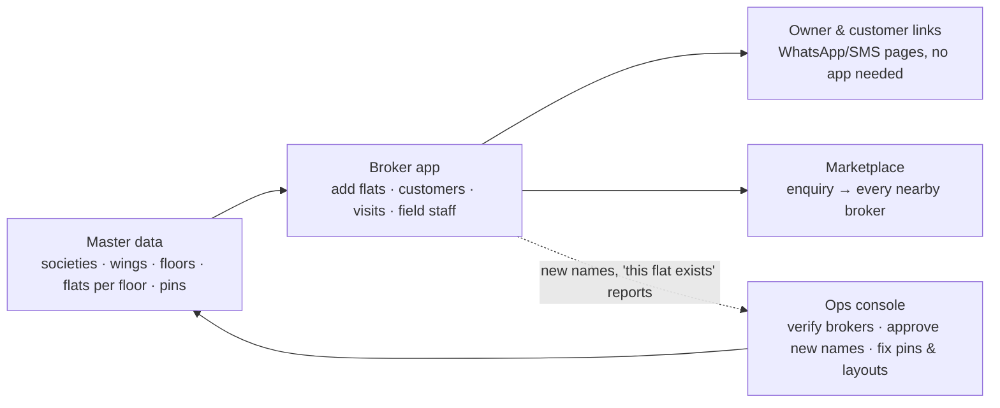

# 00 — Where this is going (one page)

_Updated 2026-09-24. Read this first; every other document hangs off it._

## The goal

**Only Broker is the broker's operating system**: the one app a broker needs to run the business
(flats, customers, site visits, field staff), plus a marketplace where customers reach brokers.
Brokers pay for it, so it has to save them time from day one.

The foundation is **clean data about real buildings**. When every flat is tied to one real building
and wing, a flat added by one broker can be matched, verified and deduplicated against everyone
else's. That is how "one flat, one truth" works, and portals can't copy it.

## How the pieces fit

1. **Master data (the universe).** Ops owns it. It is seeded from MahaRERA, field surveys and the
   pilot broker. Brokers and owners *pick* from it and never invent a building. A new name is only
   a request that ops approves or merges.
2. **Broker app.** Flats, customers (including those who never install an app), matching, visit
   plans, field staff with offline mode. Works on Android, iOS and the web.
3. **Link pages.** Owners confirm availability and customers see shortlists, all from a WhatsApp/SMS
   link, with no app and no login.
4. **Marketplace.** A customer enquiry goes to every relevant broker at once, and brokers respond
   with their terms. This comes after the pilot proves the broker app on its own.
5. **Ops console.** A small team keeps the universe clean and brokers trustworthy.

## Where we are

| Stage | What it means | Status |
|---|---|---|
| 1. Build the core | Backend, broker app, link pages, ops console, data checks | ✅ Done: 150+ automated tests, all green on GitHub |
| 2. Clean Thane West data | Pins checked by the pilot broker; wings, floors and flats per floor loaded | ⏳ **Now.** Pin-check link is live; layout sheet ready to fill |
| 3. Pilot broker uses the real app | Backend on a staging server (not the laptop), real phone numbers, real SMS/WhatsApp | ⏳ Next: needs the accounts below |
| 4. Pilot metrics | Time to add a flat, stale-listing rate, visits per customer, broker's willingness to pay | Later |
| 5. More brokers, then the marketplace | Thane West first, then neighbouring micro-markets | Later |

## Waiting on the founder

| What | Why it matters | Blocks |
|---|---|---|
| Share the pin-check link with the pilot broker ("Can interact") | Correct pins mean correct distances and matching | Stage 2 |
| Get the building-layout sheet filled (`tools/building-layouts/`) | Enables the flat-number checks for real Thane West buildings | Stage 2 |
| Open accounts: DLT sender ID + templates, WhatsApp Business, Google Cloud (Maps), a cloud server | Real messages to owners and customers; hosting outside the laptop | Stage 3 |
| Decisions D1, D2, D4, D5 (docs/05 §5) | Name, pricing at pilot, marketplace rules | Stage 4–5, not urgent |

## Principles we don't bend

- **Closed universe**: no broker or owner creates a building; typos become matches, not duplicates.
- **Conduct-based house rules only**: no religion, caste, community or gender vocabulary anywhere.
- **Offline customers are first-class**: everything a customer does in the app also works by link.
- **Each broker's data is private** (enforced by the database) unless they choose to share it.
- **Every change is audited**, and the audit trail is tamper-evident.
