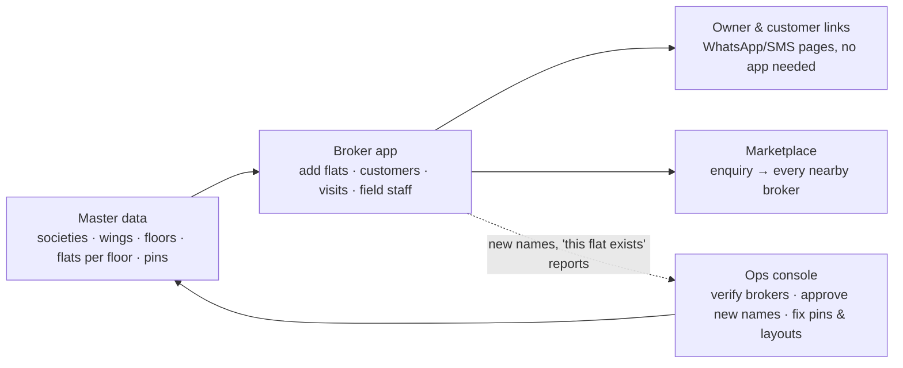

# 00 — Where this is going (one page)

_Updated 2026-09-24. Read this first; every other document hangs off it._

## The goal

**Only Broker is the broker's operating system**: the one app a broker needs to run the business
(flats, customers, site visits, field staff), plus a marketplace where customers reach brokers.
Brokers pay for it, so it has to save them time from day one.

The foundation is **clean data about real buildings**. When every flat is tied to one real building
and wing, a flat added by one broker can be matched, verified and deduplicated against everyone
else's. That is how "one flat, one truth" works, and portals can't copy it.

## How the pieces fit

1. **Master data (the universe).** Ops owns it. Wings, floors and flat numbers come only from
   official records — the TMC property-tax register, MahaRERA and IGR (docs/08) — never from brokers.
   Brokers and owners *pick* from it and never invent a building or a flat. A new name is only a
   request that ops approves or merges.
2. **Broker app.** Flats, customers (including those who never install an app), matching, visit
   plans, field staff with offline mode, updates to the broker's whole customer list, and
   **co-broking**: sharing ready flats with fellow brokers in and around the flat. Works on Android,
   iOS and the web.
3. **Link pages.** Owners confirm availability and customers see shortlists, all from a WhatsApp/SMS
   link, with no app and no login.
4. **Marketplace.** A customer enquiry goes to every relevant broker at once, and brokers respond
   with their terms. This comes after the pilot proves the broker app on its own.
5. **Ops console.** A small team keeps the universe clean and brokers trustworthy.

## Where we are

| Stage | What it means | Status |
|---|---|---|
| 1. Build the core | Backend, broker app, owner app, link pages, ops console, data checks | ✅ Done: 225+ automated tests, all green on GitHub |
| 2. Clean Thane West data | Pins checked by the pilot broker; official flat lists (TMC / MahaRERA) loaded per wing | ⏳ **Now.** Pin-check link is live; register upload is built — waiting on the TMC data request (docs/08) |
| 3. Pilot broker uses the real app | Backend on a staging server (not the laptop), real phone numbers, real SMS/WhatsApp | ⏳ Next: needs the accounts below |
| 4. Pilot metrics | Time to add a flat, stale-listing rate, visits per customer, broker's willingness to pay | Later |
| 5. More brokers, then the marketplace | Thane West first, then neighbouring micro-markets | Later |

## Waiting on the founder

| What | Why it matters | Blocks |
|---|---|---|
| Share the pin-check link with the pilot broker ("Can interact") | Correct pins mean correct distances and matching | Stage 2 |
| Send the TMC RTI / data-sharing request for the pilot wards (drafts in docs/08) and share one real property-tax bill (owner name hidden) | Official flat lists make the building universe complete and exact | Stage 2 |
| Open accounts: DLT sender ID + templates, WhatsApp Business, Google Cloud (Maps), a cloud server | Real messages to owners and customers; hosting outside the laptop | Stage 3 |
| Decisions D1, D2, D4, D5 (docs/05 §5) | Name, pricing at pilot, marketplace rules | Stage 4–5, not urgent |

## Principles we don't bend

- **Closed universe**: no broker or owner creates a building; typos become matches, not duplicates.
- **Conduct-based house rules only**: no religion, caste, community or gender vocabulary anywhere.
- **Meet brokers where they are**: staff can always pick flats their own way (society + flat number); the matching engine earns trust alongside, it is never forced.
- **Offline customers are first-class**: everything a customer does in the app also works by link.
- **A broker has two assets — their flats and their customers.** Both are theirs alone: the platform never shows, offers, moves or swaps either between brokers. Broadcasts let brokers reach all their own customers, which gives them a reason to bring offline customers onto the platform.
- **A broker's inventory is theirs alone**: flats enter only when that broker adds them, manually, on their own account. Matching and search look only at the broker's own flats (several brokers may each hold the same flat). The platform never offers a flat to a broker and never moves or swaps flats between brokers. An owner who picks a broker first ticks "Allow this broker to handle my property".
- **Co-broking is the broker's choice, trade-level only**: a broker shares their own flats (or a customer's need) with fellow brokers from their own list. Society, area, BHK and price go out; the flat number, owner, customer and commission never do, and nothing lands in anyone else's inventory.
- **Building structure comes from official sources only** (TMC, MahaRERA, IGR), never from brokers.
- **Each broker's data is private** (enforced by the database) unless they choose to share it.
- **Every change is audited**, and the audit trail is tamper-evident.
