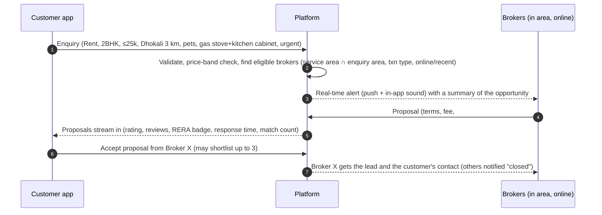

# 02 — Product Requirements Document (PRD)

| Field | Value |
|-------|-------|
| Version | 0.1 (draft) |
| Date | 2026-09-23 |
| Depends on | [01-BRD](01-BRD.md), [03-Data Model](03-data-model.md), [04-Architecture](04-architecture.md) |

Requirement IDs follow the pattern `AREA-nn`. Priority: **P0** = MVP, **P1** = public-launch
release, **P2** = later.

---

## 1. Personas

| Persona | Snapshot | Goals | Frustrations |
|---------|----------|-------|--------------|
| **Riya, tenant (29, IT, relocating to Thane)** | Searches on her phone on the train; has a beagle | Pet-friendly 2 BHK ≤ ₹25k near Dhokali within 10 days | Calls 8 brokers, repeats her needs 8 times, sees flats that "don't allow pets" at the door |
| **Suresh, broker-principal (47, Thane West, 18 years)** | 600 flats in Excel and his head; 3 field staff; RERA-registered | More closures, fewer wasted visits, recognition for being reliable | Excel is stale; staff don't know which keys are where; customers disappear |
| **Imran, broker field staff (24)** | Rides a two-wheeler, holds keys, runs 6–10 visits a day | A clear plan: who, where, when, which keys | Last-minute changes by phone; owner not informed; no route |
| **Mrs. Kulkarni, owner (61, lives in Pune, flat in Kharghar)** | Rents out one flat; distant | Reliable tenant, knowing what brokers are doing | Brokers say "flat is let" when it isn't, or vice versa; no visibility |
| **Ops admin (platform)** | Verifies brokers, merges duplicate societies, handles disputes | Clean data, fast queues | Messy Excel uploads, duplicate buildings |
| **Builder sales head** | New project in Ulwe | Mobilise channel-partner brokers in the micro-market | No structured way to reach and track local brokers |

## 2. Key journeys

### J1 — Customer sends an enquiry and chooses a broker

### J2 — Broker matches, plans the tour, dispatches staff

1. The lead opens in the broker app with the requirement pre-filled. The broker adds details from the call.
2. **Auto-match** runs against **that broker's own listings only** and returns ranked units with a
   reason for each ("✔ pets, ✔ ≤25k, ✖ 1.4 km from station").
3. Broker filters and pins units into a **visit plan**. The system suggests the best order (route
   optimisation) and time slots, and flags keys held by owner / staff / society office.
4. Plan is shared with the customer (map + photos + time windows) → customer picks a date/time.
5. Broker **assigns** the plan (or parts of it) to one or more staff. Owners get "visit scheduled"
   notices where the broker chose to send them.
6. On the day: live changes (add/remove/reorder a unit, swap staff). Everyone is notified and the
   route is recomputed.
7. After each visit: staff record the outcome (liked / rejected + reason / shortlist), and any status
   change feeds back to the unit.

### J3 — Owner invites brokers and confirms status

1. Owner registers (OTP), claims their unit (via society + flat number; verified by document or broker attestation).
2. Owner sees **brokers active near the property** (ratings, closures in the area) and **invites** some.
3. Invited brokers accept and the unit enters their inventory as a listing.
4. Owner sees an **activity timeline** per broker: visits done, customer feedback, proposals.
5. Owner confirms or rejects status changes through a one-tap link (WhatsApp/SMS) or the app.
6. At closure, owner rates brokers; broker rates owner.

### J4 — Broker bulk-uploads inventory

1. Broker downloads the template, or uploads their own Excel. The column-mapping wizard remembers
   the mapping for next time.
2. System parses rows → **staging**, and resolves each row to society → building → unit using
   fuzzy match (Data Model §5).
3. Result screen: *Matched (auto)*, *Needs your confirmation* (with suggested candidates), *New
   society proposed* (goes to admin review), *Errors*.
4. Broker confirms. Listings are created as **their private claims**. Conflicting facts go to the
   master-data resolver, never overwrite.

## 3. Functional requirements

### 3.1 Identity, onboarding and roles (AUTH)

| ID | Requirement | Priority | Acceptance criteria |
|----|-------------|----------|---------------------|
| AUTH-01 | Sign up / log in with mobile number + OTP. Email optional | P0 | OTP expires in 5 min; max 5 attempts per 15 min per number; device binding stored |
| AUTH-02 | One account can hold several roles (customer, broker, owner). Role switcher in the app | P0 | Switching role changes navigation and data scope without logging out |
| AUTH-03 | Broker onboarding: name, agency, office location, **service areas** (polygons or localities + radius), transaction types, languages, MahaRERA agent registration no. (optional in rentals, required for new-project sales), photo, ID (Aadhaar via DigiLocker/offline XML or PAN) | P0 | Broker is "Pending verification" until admin approves; can use CRM tools meanwhile, but can't respond to marketplace enquiries |
| AUTH-04 | Broker verification by admin: document check, RERA lookup, duplicate-account check | P0 | Decision + reason recorded in the audit log; broker notified |
| AUTH-05 | Broker staff accounts: principal invites staff by mobile number. Staff have restricted permissions (see §3.10) | P0 | Staff see only visit plans and units assigned to them plus the keys they hold |
| AUTH-06 | Owner onboarding and unit claim: document proof (index-II, share certificate, maintenance bill, or electricity bill) or attestation by a verified broker | P1 | Claim moves Pending → Verified; only a verified owner can confirm status changes |
| AUTH-07 | Builder profile: company, RERA project registrations, authorised signatories | P1 | Can publish projects/inventory for new sales |
| AUTH-08 | Consent capture per purpose (marketing, sharing contact with a chosen broker, location) under DPDP | P0 | Consent records are versioned; can be withdrawn in settings |

### 3.2 Master data: societies, buildings, units (MD)

| ID | Requirement | Priority | Acceptance criteria |
|----|-------------|----------|---------------------|
| MD-01 | Canonical registry of **localities → societies/projects → buildings/wings → units** for MMR | P0 | Each society has a map pin (and a boundary polygon if known), address, pin code, locality, aliases |
| MD-02 | Seed pipeline from public/licensed sources (MahaRERA projects, OSM, planning-authority data, Google Places where permitted) | P0 | Import job is idempotent; each record keeps its provenance |
| MD-03 | **Alias learning:** every confirmed mapping of a raw name ("Hira Nandani Estate", "Hiranandani Est.", "HE Thane") to a society is stored as an alias | P0 | The next upload auto-matches the alias with confidence ≥ 0.95 |
| MD-04 | **No auto-creation of societies from uploads.** Unknown names create a *provisional society proposal* for admin review with nearby candidates | P0 | Provisional societies are usable by the proposing broker only until approved/merged |
| MD-05 | Admin **merge** of duplicate societies/buildings/units with full re-pointing of listings and aliases, and undo | P0 | Merge is atomic; audit entry; undo within 30 days |
| MD-06 | Every unit has **its own map location**, inherited from building and adjustable within 150 m by admin/owner | P0 | Distance-based attributes are recomputed on location change |
| MD-07 | **Computed location facts** per building: distance and walk time to nearest railway/metro station, auto-rickshaw stand, bus stop, schools, hospitals, markets (from POI data) | P0 | Distances shown as facts ("650 m / 8 min walk to Thane stn"). Brokers can't overwrite them |
| MD-08 | Unit attributes as defined in the **approved Unit Attribute Dictionary** (founder-approved; loaded from `backend/apps/masterdata/dictionary/attribute_dictionary.yaml`). Draft v0.1 covers: BHK/type, carpet area (RERA carpet), floor/total floors, facing, furnishing (+ item checklist: gas stove, kitchen cabinet, wardrobes, ACs…), parking, amenities (lift, power backup, gym, pool…), **house rules** (pets, smoking, non-veg, bachelors/family, max occupants), age of building, OC status | P0 | Attribute dictionary is data-driven (admin can add attributes without code changes) |
| MD-14 | **Official flat registers** (*D18*): each wing's list of flats comes from official records — TMC property-tax register, MahaRERA, IGR — never from brokers. From a complete list the layout is worked out (top floor, first floor with flats, flats per floor, refuge floors, odd flats); a flat number outside a complete list cannot be added. Owner names and other personal columns in a source file are never stored. Uploaded by ops (check first, then save) or from the command line; template in `tools/building-layouts/` | P0 | Re-import is harmless; every import audited; sources in docs/08 |
| MD-15 | **Building picture**: every wing floor by floor (refuge floors shown), from the official list or the layout, in the app and ops console. The asking broker's own flats are marked; other brokers' inventory is never shown | P1 | Opened from any flat page |
| MD-13 | **Closed universe of buildings.** Each wing records floors, first floor with flats, flats per floor, floors with no flats (refuge/podium) and known exceptions (penthouses). Brokers pick a wing from the list; a flat number that cannot exist is refused. Seeded from MahaRERA, field survey and ops; imported from a spreadsheet | P0 | Verified layout: "2504" in a 20-floor wing is refused at entry and in uploads, with the reason; the broker can report "this flat really exists" to ops. Unverified layout: warning the broker confirms. Society marked "all wings listed": unknown wing names are refused with the closest real wing suggested |
| MD-09 | **One unit, one truth:** conflicting attribute values from different sources are resolved by the trust hierarchy; conflicts are flagged "disputed" (Data Model §6) | P0 | UI shows the resolved value + source badge (Computed / Owner / Verified / Broker consensus / Single broker) |
| MD-10 | Any party (customer after a visit, broker, owner) can **suggest a correction** to a unit variable | P1 | Suggestion enters the resolver; the suggester's trust weight applies |
| MD-11 | **Shared flat media** (*D15, decided 2026-09-24*): photos and a video walkthrough belong to the flat, shared by everyone handling it — at most **5 photos and 1 video** live. The owner and the brokers holding the flat may upload; **customers never**. Nothing a broker uploads goes live until the **owner approves** it (the owner is notified); the owner's own uploads are live at once | P1 | Approve refuses past the caps ("remove one first"). A flat whose owner isn't on the platform keeps broker uploads waiting until the owner joins. Photos cleaned (EXIF removed); files private, reached by short-lived signed links |
| MD-12 | Upcoming/under-construction projects tracked with possession dates and RERA numbers | P1 | New-sale inventory attaches to project → tower → unit type/unit |

### 3.3 Broker inventory (INV)

| ID | Requirement | Priority | Acceptance criteria |
|----|-------------|----------|---------------------|
| INV-01 | Broker adds a **listing** (their private claim on a unit) manually: pick society (search with fuzzy match + map) → building → unit no./floor → transaction type → asking rent/price, deposit, availability date, brokerage terms, key location, owner contact, private notes | P0 | Takes < 90 s for a known society; unit master auto-created or linked |
| INV-02 | **Multiple brokers can claim the same unit**; each claim is private | P0 | Broker A can never see B's claim, price, owner contact or notes (tested by automated row-level security tests) |
| INV-02a | **Inventory is built only by the broker.** A broker may add any flat manually, in any scenario (their own owner contacts, a flat they come across on the way, an owner who approached them). The platform **never offers** a flat that is not in a broker's inventory, and never moves or swaps flats between brokers. Matching and search look only at the broker's own inventory (*decided by the founder 2026-09-24*) | P0 | No API returns another broker's flats or suggests flats to add; a search with no result says only "none of your flats matches" |
| INV-03 | Bulk upload (Excel/CSV) with a column-mapping wizard, saved mappings, staging, resolution queue (see J4) | P0 | 1,000 rows processed in < 60 s; row-level errors downloadable |
| INV-04 | Listing states follow the unit status model (Data Model §4). A broker updates *their listing*; the unit's master status changes only through the status rules | P0 | See STAT-* |
| INV-05 | Keys register: where the keys are (owner, broker office, staff X, society office, lock-box code, hidden securely) | P0 | Key custody changes are logged; staff see keys only for their assignments |
| INV-06 | Inventory views: list, map, filters (txn type, BHK, budget, locality, status, staleness), saved filters | P0 | Map clusters at zoom < 15 |
| INV-07 | Staleness nudges: listings not reconfirmed in 21 days (rent) / 45 days (sale) get a reminder; at 30/60 days they become "Status unverified" | P0 | Nudges batched daily; reconfirm is one tap |
| INV-08 | Owner invite → broker acceptance creates the listing pre-filled from master. The invite exists only after the owner ticks **"Allow this broker to handle my property"** for that broker (OWN-02) | P1 | Owner-invited listings carry an "Owner-appointed" badge; no invite, no pre-filled listing |
| INV-09 | Export own inventory to Excel | P1 | Only own listings |
| INV-10 | **Find any flat among 1,000+** (approved design, 2026-09-24): one search box for society/wing/flat number (nicknames and typos), owner name or owner phone; filter chips (available, rent/sale, BHK, budget, area), sort, quick views with counts (reconfirm due, new this week, keys at office, no photos yet), browse by society → wing, paged results with photo thumbnails | P0 | Only the broker's own flats (RLS); field staff see only flats on their visits |
| INV-11 | **Flat page** (approved design): photos and walkthrough first; price, deposit, status with last confirmation; quick actions (call owner, share with a customer, add to a visit, status); "N of your customers fit"; key facts, house rules, what's in the flat and the society, distances, the building floor by floor; a private block (owner, keys, brokerage, notes, how many other brokers hold it — never who); activity. A "what customers see" switch hides everything private, including the flat number and wing | P0 | Private sections only for principals/managers |

### 3.4 Unit status: the key field (STAT)

| ID | Requirement | Priority | Acceptance criteria |
|----|-------------|----------|---------------------|
| STAT-01 | Master status values: `AVAILABLE`, `AVAILABLE_UNCONFIRMED`, `ON_HOLD` (token / negotiation), `LET`, `SOLD`, `OFF_MARKET`, `UNKNOWN` | P0 | Stored with timestamp, actor, source, confidence |
| STAT-02 | **Last update wins for downgrades.** Any broker with a listing can move a unit to `ON_HOLD`/`LET`/`SOLD`/`OFF_MARKET`, and the master reflects it at once (this protects customers from wasted visits) | P0 | Other brokers with listings are notified "Unit reported LET by another broker (unconfirmed)" without revealing who |
| STAT-03 | **Upgrades to availability need owner confirmation.** A change from `LET`/`SOLD`/`OFF_MARKET` → `AVAILABLE` sets `AVAILABLE_UNCONFIRMED` and sends the verified owner a confirmation request. The owner's YES → `AVAILABLE`. NO → revert + note | P0 | UI label: "Available for rent — not yet confirmed by owner" |
| STAT-04 | If there is no verified owner, the status stays `AVAILABLE_UNCONFIRMED` until either (a) an owner claims the unit, or (b) ≥ 2 independent brokers report availability within 7 days → `AVAILABLE` with "broker-consensus" source | P0 | Consensus rule configurable |
| STAT-05 | Owner confirmation link works **without the app** (signed, one-time, 72 h expiry) via WhatsApp/SMS | P0 | Link opens a light web page: Yes / No / "Available from <date>" |
| STAT-06 | Status auto-decay: `AVAILABLE` with no confirmation for 30 days (rent) / 90 days (sale) → `AVAILABLE_UNCONFIRMED`; `LET` automatically prompts "likely available" near the licence end date if known | P1 | Scheduled job; owner/broker nudged |
| STAT-07 | Every status change is written to an **append-only, hash-chained status ledger** | P0 | Verification endpoint reports chain integrity |
| STAT-08 | Conflicting reports (broker A says LET, owner says AVAILABLE) → owner wins; repeated conflicts flag the listing for admin review | P0 | Admin queue item created |

### 3.5 Marketplace: map and enquiry (MKT)

| ID | Requirement | Priority | Acceptance criteria |
|----|-------------|----------|---------------------|
| MKT-01 | Customer **map view**: clusters showing (a) count of available units matching the chosen txn type/BHK/budget, (b) **online brokers** serving that area, (c) the price band (P25–P75) for the chosen interest | P0 | Only aggregates, never a broker's listing details. Clusters refresh on pan/zoom within 500 ms (p95) |
| MKT-02 | Customer can browse **public unit cards** only where the broker/owner opted to publish (photos, resolved attributes, approximate location to society level, price band, "via N brokers") | P1 | Exact flat number never shown publicly |
| MKT-03 | **Enquiry composer**: txn type, property type, BHK, budget (min–max), area (search locality / draw on map / radius from pin), move-in date, urgency, must-haves (from the attribute dictionary incl. furnishing items), house-rule needs (pets, non-veg cooking, bachelors…), occupants, notes (free text; moderated) | P0 | Summary preview reads like: "2 BHK on rent, urgent, around Dhokali (3 km), ≤ ₹25k, pet-friendly society, gas stove + kitchen cabinet" |
| MKT-04 | **Real-time broadcast** of the enquiry to eligible brokers: verified, serving the area, txn type matches, not at the lead limit, online or active in the last 24 h | P0 | Online brokers get an in-app alert (sound + banner) within 3 s (p95); others get a push |
| MKT-05 | Broker alert shows the summary, distance, **number of matching units in their own inventory**, time left to respond | P0 | Customer contact hidden until the customer accepts |
| MKT-06 | Broker **proposal**: message, brokerage terms (e.g. "1 month's rent + GST" / "1% of sale value"), matching-unit count, earliest visit slot, optional 1–3 teaser units (society-level only) | P0 | Uses 1 lead credit when the plan requires it |
| MKT-07 | Customer sees proposals live, sorted by relevance (rating, response time, match count, closures in the area). Promoted proposals are labelled | P0 | Proposal card: photo, name, agency, RERA badge, ★ rating (n), top review snippets, response time, terms |
| MKT-08 | Customer accepts up to **3** proposals. Accepted brokers get the customer's contact (number masked through the calling proxy in P1) and the lead in their CRM | P0 | Non-accepted brokers notified; their proposals are archived |
| MKT-09 | Enquiry lifecycle: `OPEN` → `IN_PROGRESS` (≥ 1 accepted) → `FULFILLED` / `CANCELLED` / `EXPIRED` (default 14 days) | P0 | Customer can pause or close at any time |
| MKT-10 | Anti-spam: max 3 open enquiries per customer, OTP-verified numbers, customer trust score, and brokers can report fake enquiries (credit refund on validation) | P0 | Reports go to the admin queue |
| MKT-11 | Broker "online" toggle + working hours; presence shown on the customer map | P0 | Presence expires after 10 min of no heartbeat |

### 3.6 Broker CRM: customer book (CRM)

| ID | Requirement | Priority | Acceptance criteria |
|----|-------------|----------|---------------------|
| CRM-01 | Broker's customer book keyed by mobile number: name, requirements (many over time), enquiries, proposals, visit plans, visit outcomes, notes, documents | P0 | Private to the broker (and their staff as permitted) |
| CRM-02 | Capture requirements from a **phone call** (broker enters on the customer's behalf; source = phone) as well as marketplace leads | P0 | Same structure as the marketplace enquiry; not broadcast |
| CRM-03 | Full timeline per customer across all interactions with that broker | P0 | Chronological; filter by type |
| CRM-04 | Follow-up reminders and pipeline stages (New → Contacted → Visits planned → Shortlisted → Negotiation → Closed won / lost + reason) | P1 | Kanban board on desktop |
| CRM-05 | Duplicate customer detection within a broker's book (same number) | P0 | Merge prompt |
| CRM-11 | **Import the existing customer list** at once: Excel/CSV, a phone contacts export (.vcf) or pasted lines. One record per number per broker (existing numbers are not duplicated); invalid rows are listed | P0 | Private to the firm (RLS); imported customers get updates in the app once they log in |
| CRM-10 | **Broadcasts to the broker's own customers** (*D16*): one message — one or several new flats (up to 10; society-level, never the flat number), price drop in an area, or news — to all of the broker's customers or those looking in one area. Pilot: delivered **in the app**, to all customers, **free**; customers not on the app are listed with a ready WhatsApp invite so bringing offline customers onto the platform pays off. A customer can turn a broker's updates off | P0 (pilot) | Only the firm's own customers (RLS); field staff cannot broadcast; each broadcast records its reach for paid credits after the pilot |

### 3.7 Matching (MATCH)

| ID | Requirement | Priority | Acceptance criteria |
|----|-------------|----------|---------------------|
| MATCH-01 | Auto-match a requirement against **the broker's own listings** (never others') | P0 | Result < 1 s for 5,000 listings |
| MATCH-02 | Hard filters: txn type, BHK, budget (±10% tolerance, configurable), geo area, availability status (`AVAILABLE`, optionally `AVAILABLE_UNCONFIRMED`), house-rule clashes | P0 | Units breaking a hard filter are excluded, and the exclusion can be viewed with its reason |
| MATCH-03 | Soft scoring: distance to station/school/auto stand, amenities, furnishing items, floor preference, freshness of status, photo availability | P0 | Score 0–100 with an explanation chip per criterion (✔/✖/≈) |
| MATCH-04 | Broker can override filters, pin/unpin units, and save as a visit plan | P0 | — |
| MATCH-05 | Re-run matching instantly when a requirement changes mid-tour (e.g. a new constraint surfaces at the site) | P0 | The plan shows which remaining units now clash |
| MATCH-06 | (P2) Learning-to-rank from visit outcomes (liked/rejected reasons) | P2 | Offline evaluation beats heuristic nDCG@5 by ≥ 10% |

### 3.8 Site-visit planning and dispatch (VISIT)

| ID | Requirement | Priority | Acceptance criteria |
|----|-------------|----------|---------------------|
| VISIT-01 | Create a **visit plan** from matched units: date, start point, per-unit time slot, dwell time (default 15 min), travel mode | P0 | Route order optimised (min travel time) with manual reorder |
| VISIT-01a | **Pick flats yourself.** On the visit plan, the matching screen and a customer's page, staff type the society (any spelling or nickname) and flat number they have in mind ("HE A-1203", "Rodas B 502", "1203") and add it directly, without the matching engine | P0 | Only the broker's own flats are searched (INV-02a); a flat not in their inventory is simply not found and nothing is offered. Exact flat number and the named wing rank first; the flat is on the route in ≤ 3 taps |
| VISIT-02 | Share the plan with the customer (in-app, or a WhatsApp link to a web view): map, photos, society-level location, time windows. Customer proposes/accepts date and time | P0 | Customer sees exact addresses only after confirming |
| VISIT-03 | **Assign** the whole plan or individual stops to one or more staff; staff get the itinerary with navigation links, key instructions and customer contact | P0 | Staff must accept; unaccepted assignments escalate after 30 min |
| VISIT-04 | **Key logistics:** each stop shows key custody; conflicting key needs (same key needed by two plans at overlapping times) are flagged | P0 | Conflict warning at plan-save |
| VISIT-05 | **Notify owner** of scheduled visits (per-listing setting: always / ask / never) with an optional request for owner presence | P0 | Owner can reply "OK" / "Not available at this time" |
| VISIT-06 | **Live changes:** add/remove/reorder stops, swap staff, delay; all parties notified; ETA recomputed | P0 | Update reaches staff within 3 s when online |
| VISIT-07 | Staff check-in/check-out at each unit (geofence ≤ 200 m, optional), outcome capture: liked / rejected (reason codes) / shortlisted / second visit | P0 | Outcomes flow into CRM and the unit's status, feedback and attribute suggestions |
| VISIT-08 | Broker "dispatch board" (desktop): today's plans, staff locations (with consent, during shifts only), delays | P1 | Auto-refresh; staff location stops at shift end |
| VISIT-09 | Customer can cancel/reschedule; no-show tracking affects the customer trust score | P1 | — |

### 3.9 Owner and builder (OWN)

| ID | Requirement | Priority | Acceptance criteria |
|----|-------------|----------|---------------------|
| OWN-00 | **Owner registers their flat** (route 1): pick society → wing → flat number from our building universe (MD-13 checks apply), declare ownership and upload a **proof document** (index II, share certificate or electricity bill). The proof is kept but **not checked by anyone** — it deters false claims, it does not block (*decided 2026-09-24, D14*) | P1 | Registering never hands the flat to any broker. The proof is private (owner; ops only in a dispute). Two people claiming one flat raises an ops note, not a block |
| OWN-01 | Owner map of **active brokers around the property** (radius), with ratings, closures in the area, response time | P1 | Only verified brokers |
| OWN-02 | **Invite brokers** to represent the unit (one or many). Before a broker receives the flat, the owner must tick **"Allow this broker to handle my property"** for that specific broker. Invitation carries preferred terms (expected rent, deposit, availability, house rules) | P1 | No tick, no invitation. The tick is recorded with time and is audited. Broker accepts or declines; accepted → listing created (INV-08) |
| OWN-03 | Owner's **flat status view**, read-only: current status (available / on hold / rented / sold) and **"Currently serviced by <broker firm> · <broker contact number>"** for each broker handling the flat, with a **"Review this broker"** action for the transaction they handled (REV-01). No approval or policing of which brokers list the flat is required of the owner (*decided 2026-09-24*) | P1 | Data from linked broker listings; the owner sees broker name and business number only, never the broker's private notes or customers |
| OWN-04 | Owner confirms status changes (STAT-03/05) and receives visit notices (VISIT-05) | P0 (via link) / P1 (in app) | — |
| OWN-05 | Owner uploads **photos and walkthrough videos** and edits owner-authoritative attributes (house rules) and preferred terms. Photos are cleaned (upright, resized, location and camera details removed). Media is shown to every broker holding the flat and — behind a switch that is on — on customer shortlist pages (photos only, never the flat number) | P1 | Owner edits take precedence (Data Model §6). Files are private and reached only through short-lived signed links |
| OWN-06 | Owner **unticks "Allowed to handle my property"** for any broker, invited or self-added (*D14*): the listing is marked "Owner removed you", hidden from matching, search and visit plans, and the firm **cannot re-add the flat** until the owner ticks again. The broker can ask to be added back with a message; the owner's decision is final | P1 | Broker notified; the owner sees the request on the flat page |
| OWN-07 | Builder: publish project + tower + unit types/units + price list; invite/approve channel-partner brokers; track leads per broker | P2 | RERA project number mandatory |

### 3.9a Co-broking with fellow brokers (TRADE) — *D17*

Moving ready inventory has three routes: (A) a blast to fellow brokers (channel partners), (B) walk-in and
platform customers, (C) a blast to the whole customer list (CRM-10/11). This section covers A.

| ID | Requirement | Priority | Acceptance |
|----|-------------|----------|------------|
| TRADE-01 | Each broker keeps **their own list of fellow brokers** (name, agency, mobile, office address/area, notes), adds to it any time, and imports it from Excel/CSV, phone contacts (.vcf) or pasted lines. Office area is matched to our localities; a pin can be set | P0 | Private to the firm (RLS); one entry per number; fellow brokers who use Only Broker are recognised by their number |
| TRADE-02 | **Share ready flats** from the broker's own inventory (one or several, up to 10) with fellow brokers **in and around the flat's location** (default 3 km), **widened** by the broker, to **everyone** on the list, or to **ticked names** | P0 | Preview lists every fellow broker with distance, pre-ticked by the chosen rule; brokers with no known area are reached only via "everyone" or a tick |
| TRADE-03 | **Trade-level details only**: society, area, BHK, rent/price, availability, and the sending broker's name and number. Never the flat number, wing, owner or owner's number; **no commission terms**. No owner permission needed (a trade agreement between brokers) | P0 | Tests assert the flat number, wing, owner name and brokerage terms never appear |
| TRADE-04 | Fellow brokers on Only Broker get the blast in their **trade inbox** in the app; the rest get a ready WhatsApp message (one tap each, until WhatsApp Business is connected) | P0 | Delivered once per firm |
| TRADE-05 | The receiver answers **"I have a customer"** (or "I have a flat" / "not now"); the sender sees replies with the replier's name and number | P0 | The listing broker stays in charge of the flat and the visit; nothing is ever added to the other broker's inventory |
| TRADE-06 | **Ask fellow brokers for a flat** (requirement blast, good-to-have): from one of the broker's customer requirements; what is wanted, never who wants it | P1 | Customer name and number never appear |
| TRADE-07 | Only principals and managers can blast; field staff cannot | P0 | 403 for staff |

### 3.10 Broker organisation and permissions (ORG)

| Permission | Principal | Manager | Field staff |
|------------|:---------:|:-------:|:-----------:|
| View all listings of the agency | ✔ | ✔ | Assigned only |
| Owner contact on listing | ✔ | ✔ | ✖ (masked) unless the stop needs it |
| Create/edit listings | ✔ | ✔ | ✖ (suggest only) |
| Respond to marketplace enquiries | ✔ | ✔ | ✖ |
| View customer book | ✔ | ✔ | Assigned customers only |
| Assign visit plans | ✔ | ✔ | ✖ |
| Billing & subscription | ✔ | ✖ | ✖ |

ORG-01 (P0): role-based permissions as above. ORG-02 (P1): multi-office agencies. ORG-03 (P0):
a removed staff member loses access immediately and their held keys are flagged for handover.

### 3.11 Reviews and reputation (REV)

| ID | Requirement | Priority | Acceptance criteria |
|----|-------------|----------|---------------------|
| REV-01 | **360° reviews:** Customer→Broker, Broker→Customer, Owner→Broker, Broker→Owner, Customer→Unit (accuracy of listing) | P0 (C→B, B→C), P1 (others) | Reviews are allowed only after a verified interaction (completed visit or closed deal) |
| REV-02 | Star rating (1–5) + tags (punctual, honest listing, knowledgeable, responsive…) + optional text (moderated) | P0 | One review per interaction per direction; editable for 7 days |
| REV-03 | Broker reputation: Bayesian-averaged rating, response time, closures, "listing accuracy" (share of visited units that matched their description) | P0 | Formula documented; displayed on proposals |
| REV-04 | Right of reply for the reviewed party; report abuse | P1 | — |
| REV-05 | Anti-gaming: reviews from the same device/IP cluster, and review bursts, are flagged | P1 | — |

### 3.12 Notifications and communication (NOTIF)

| ID | Requirement | Priority | Acceptance criteria |
|----|-------------|----------|---------------------|
| NOTIF-01 | Channels: in-app real-time (WebSocket), push (FCM/APNs), WhatsApp Business templates, SMS (DLT) fallback | P0 | Delivery attempts and outcomes are logged |
| NOTIF-02 | Per-user preferences and quiet hours (enquiry alerts may override for "online" brokers) | P0 | — |
| NOTIF-03 | In-app chat between customer and accepted broker(s) and between broker and staff | P1 | Media attachments; retention per policy |
| NOTIF-04 | Masked calling (virtual numbers) between customer and broker | P1 | Call logs attach to the CRM timeline |

### 3.13 Monetisation (BILL)

| ID | Requirement | Priority | Acceptance criteria |
|----|-------------|----------|---------------------|
| BILL-01 | Plans and entitlements (listings cap, staff seats, free leads/month) configured in admin | P0 (config), P1 (paid) | Entitlement checks enforced server-side |
| BILL-02 | Lead credit wallet, top-up via Razorpay/Cashfree (UPI, cards), GST invoices | P1 | Invoice numbering compliant; ledger is double-entry |
| BILL-03 | Credit refund on validated fake-enquiry reports | P1 | — |

### 3.14 Admin console (ADM)

| ID | Requirement | Priority |
|----|-------------|----------|
| ADM-01 | Broker verification queue | P0 |
| ADM-02 | Master-data workbench: provisional society review, merge/split, alias management, map editing of pins/polygons | P0 |
| ADM-03 | Attribute dictionary & house-rule catalogue management | P0 |
| ADM-04 | Conflict/dispute queue (status conflicts, disputed attributes, reported enquiries, abusive reviews) | P0 |
| ADM-05 | Micro-market configuration: launch flags, pricing, lead limits, broadcast radius defaults | P0 |
| ADM-06 | Dashboards: supply, demand, response times, conversion, data health (BRD §9) | P1 |
| ADM-07 | Audit log viewer + chain verification | P0 |
| ADM-08 | DPDP operations: data export/deletion requests, consent reports, grievance tickets | P0 |
| ADM-09 | Impersonation for support: read-only, time-boxed, audited, with user notified | P1 |

### 3.15 Offline customer servicing (OFF)

Brokers pay for the platform, and most of their business still starts **offline**: walk-ins at
the office, phone calls, referrals, society notice boards. The platform has to serve those
customers fully even when **the customer never installs the app**, and it must keep working when
**the broker or staff has no network** (basements, lift lobbies, patchy suburbs).

**Principles**
- An offline customer is a first-class customer in the broker's book. Every broker feature (match,
  visit plan, owner notice, reviews) works for them.
- Customers reach the platform through **links, not installs**: WhatsApp or SMS links open light
  web pages; a printable PDF is available for customers who want paper.
- Offline customers are the broker's own leads and **never consume lead credits** and are **never
  broadcast** to other brokers.
- The customer's consent is captured without the app (DPDP).

| ID | Requirement | Priority | Acceptance criteria |
|----|-------------|----------|---------------------|
| OFF-01 | **Quick capture** of an offline customer: mobile number, name, source (`walk_in`, `phone_call`, `referral`, `hoarding/board`, `whatsapp_group`, `other`), requirement in the same structure as an enquiry. Voice-note attachment allowed | P0 | New customer + requirement saved in ≤ 60 s on mobile; works offline (queued) |
| OFF-02 | **Consent without the app:** (a) OTP sent to the customer's phone and read out to the broker, or (b) a WhatsApp/SMS consent link the customer taps, or (c) broker-attested verbal consent (timestamped, reason recorded, flagged for later link confirmation) | P0 | Until consent is confirmed, only name + number + requirement are stored and no messages other than the consent request are sent |
| OFF-03 | **Shortlist link:** broker shares selected units as a WhatsApp/SMS link → a web page with photos, resolved attributes, computed distances, society-level location, and "I'm interested / Not for me" buttons per unit | P0 | Responses flow back into the CRM timeline and match feedback |
| OFF-04 | **Visit plan link:** date/time proposal and confirmation, itinerary with map, the staff member's name and number, day-of updates (delays, reorders) by WhatsApp/SMS | P0 | Same visit plan object as for app customers (VISIT-02/06) |
| OFF-05 | **Printable sheets:** PDF shortlist and visit itinerary (broker's branding, QR code back to the live link) | P1 | Generated in < 5 s; no owner contact or flat number unless the broker chooses to include them |
| OFF-06 | **Walk-in office mode (desktop):** big-screen requirement capture, instant matching with side-by-side units, "send to customer's WhatsApp" in one click | P1 | Designed for a broker across the desk from the customer |
| OFF-07 | **Call & interaction log:** log phone calls, office meetings and WhatsApp conversations against the customer (manual now; automatic with masked calling, NOTIF-04) | P0 (manual) | Timeline shows every touchpoint regardless of channel |
| OFF-08 | **Reviews from offline customers:** after a completed visit or closed deal, the customer receives a one-time review link. Reviews count towards broker reputation and are labelled "verified visit" | P0 | Because visit completion is recorded by staff check-in, no app is needed to prove the interaction |
| OFF-09 | **Profile claim:** if an offline customer later installs the app with the same number, they see their own requirements, shared shortlists and visit plans with that broker (never the broker's private notes) and can continue in-app | P1 | Linkage via phone hash; customer must pass OTP |
| OFF-10 | **Offline-capable field app:** today's itinerary, stop details, key instructions (encrypted on device), customer contact and outcome forms are available with no network; actions are queued and synced with idempotency keys | P0 | Staff can complete a full day's visits in airplane mode and sync later without duplicates |
| OFF-11 | **Sync conflict rules:** server state wins for plan structure (stops added/removed by the broker); device wins for outcomes and check-in times it recorded; conflicts are shown to the broker | P0 | Covered by automated sync tests |
| OFF-12 | **Offline inventory lookup:** broker can search their own listings (last synced copy, including key custody) without network | P1 | Local encrypted store; wiped on logout or on remote revoke |
| OFF-13 | **Owner offline flows:** owners who never install the app still confirm status (STAT-05), acknowledge visits (VISIT-05) and review brokers (REV-01) via links; brokers can record an owner's phone confirmation, flagged as "broker-recorded" (lower trust than an owner click) | P0 | Status source shows "owner (link)" vs "owner (via broker)" |
| OFF-14 | **Bulk import of the broker's existing customer list** (Excel/CSV/phone contacts, with consent status "not yet confirmed") | P1 | Imported contacts are not messaged until the broker triggers a consent request |

## 4. Non-functional requirements (NFR)

| ID | Category | Requirement |
|----|----------|-------------|
| NFR-01 | Performance | API p95 < 300 ms for reads, < 600 ms for writes; map cluster query p95 < 500 ms; enquiry fan-out to 500 brokers < 3 s |
| NFR-02 | Scale (year 1) | 10k brokers, 300k units, 1M listings, 5k enquiries/day, 2k concurrent WebSocket connections at peak; architecture should reach 10× without redesign |
| NFR-03 | Availability | 99.5% monthly (Phase 1), 99.9% (Phase 2); RPO ≤ 15 min, RTO ≤ 2 h |
| NFR-04 | Security | OWASP ASVS L2; TLS 1.2+; encryption at rest; secrets in a vault; row-level isolation of broker data enforced in the database (PostgreSQL RLS), not only in the app |
| NFR-05 | Privacy | DPDP compliance; PII minimisation; phone numbers encrypted at rest (with deterministic hash for lookup); data in India |
| NFR-06 | Auditability | Append-only, hash-chained audit for status, verification, merges, permissions, billing |
| NFR-07 | Mobile | Android 9+ and iOS 15+; works on 3G / patchy networks (offline queue for visit outcomes); app size < 40 MB |
| NFR-08 | Accessibility / language | English at launch; Hindi and Marathi in P1 (i18n from day one); WCAG 2.1 AA on web |
| NFR-09 | Observability | Structured logs, traces, metrics; alerts on the broadcast pipeline, queue lag, error budgets |
| NFR-10 | Cost | Map/API spend tracked per feature; infra < ₹1.5 lakh/month at year-1 scale |

## 5. MVP (Phase 1) cut — "Thane West pilot"

**Goal:** prove the broker tool plus the enquiry broadcast in **one micro-market cluster (Thane
West: Dhokali, Manpada, Kolshet, Hiranandani Estate, Ghodbunder Rd, Majiwada)** with ~100 brokers.

In MVP (all P0 items), in short:

- OTP auth, roles, broker onboarding + admin verification, staff accounts
- Master data seed for the pilot cluster + fuzzy society search + provisional society workflow + merge
- Listings (manual + Excel upload), keys register, staleness nudges
- Unit status engine with owner confirmation via link, hash-chained ledger
- Customer map (aggregates), enquiry → real-time broadcast → proposals → accept
- Broker CRM, matching with explanations, visit plans with route order, staff assignment, owner visit notice, live changes, visit outcomes
- Customer↔Broker reviews
- Push + WhatsApp + SMS notifications
- Offline customer servicing: quick capture, consent without app, shortlist and visit-plan links, offline-capable field app, offline-customer reviews (all OFF P0 items)
- Admin console essentials (ADM-01..05, 07, 08)

Not in MVP: payments, chat, masked calling, builder module, owner app (owners use links),
public unit cards, dispatch board, ML ranking.

## 6. UX principles

1. **Broker-speed first**: every frequent broker action takes ≤ 3 taps. Big touch targets; works
   one-handed on a two-wheeler stop.
2. **Explain the machine**: every match, status and resolved attribute shows *why* (source badge,
   reason chips).
3. **Private by default, visibly**: "Only you can see this" markers on private fields.
4. **Links over installs** for owners and customers (WhatsApp deep links to light web views).
5. **Map is home** for customers; **Today (visits + leads)** is home for brokers.

## 7. Key screens (inventory)

| Surface | Screens |
|---------|---------|
| Customer app | Map home · Enquiry composer · Proposals · Broker profile · Visit plan · My enquiries · Reviews · Profile/consents |
| Broker app | Today · Leads (alerts, proposals) · Customer book · Customer detail/timeline · Match results · Visit plan builder · Inventory (list/map) · Listing detail · Add listing · Keys · Staff · Profile/plan |
| Staff app | My day (itinerary) · Stop detail (keys, navigation, check-in, outcome) |
| Owner (web link → app in P1) | Confirm status · Visit notice · My units · Brokers near me · Invite · Activity |
| Broker desktop | Inventory grid · Excel upload & resolution · CRM Kanban · Dispatch board · Reports |
| Admin desktop | Verification · Master-data workbench · Disputes · Micro-market config · Dashboards · Audit · DPDP desk |

## 8. Analytics events (minimum)

`enquiry_created`, `enquiry_broadcast` (n_recipients), `proposal_sent` (latency_s),
`proposal_accepted`, `match_run` (n_results, top_score), `visit_plan_created`,
`visit_stop_outcome`, `status_change_requested` / `_confirmed` / `_rejected`, `listing_created`
(source), `upload_row_resolved` (auto/manual/provisional), `review_submitted`.
PII is never sent to analytics; user IDs are pseudonymous.

## 9. Traceability: founder brief → requirements

| Brief item | Requirement(s) |
|------------|----------------|
| Rent / Sale (new, resale) | MD-12, INV-01, MKT-03, OWN-07 |
| Customer sees units + active agents like Ola/Uber | MKT-01, MKT-11 |
| Enquiry beeps across all agents' screens | MKT-04, MKT-05, NOTIF-01 |
| Pings from agents with T&C, ratings, reviews | MKT-06, MKT-07, REV-03 |
| Google-style cluster view + price range | MKT-01 |
| Capture requirement (typed or phone call) | MKT-03, CRM-02 |
| Auto-match to the broker's own inventory only | MATCH-01, INV-02, NFR-04 |
| Filter to a site inspection plan | MATCH-04, VISIT-01 |
| Share plan, ask customer for date/time | VISIT-02 |
| Every unit has its own Google Map location | MD-06 |
| Assign plan to staff | VISIT-03, ORG-01 |
| Notify owner of visit | VISIT-05 |
| Last-minute planning | VISIT-06, MATCH-05 |
| Retain customer database with history | CRM-01, CRM-03 |
| Status tag as KEY; owner YES needed to reopen | STAT-01…08 |
| Owner locates brokers, invites, tracks, rates | OWN-01…03, REV-01 |
| Owner video; any party updates variables | MD-10, MD-11, OWN-05 |
| 360° reviews | REV-01…05 |
| Brokers serve walk-in / phone customers who never install the app (founder review, 2026-09-23) | OFF-01…14 |
| Surprises at the site that change which flats are suitable | MD-08 (conduct-based house rules), MATCH-02, BRD §10.2 |
| Universe of societies (MMR) | MD-01, MD-02, MD-13, MD-14, MD-15 |
| Ready inventory: blast to fellow brokers / walk-ins / whole customer list (founder meeting, 2026-09-24) | TRADE-01…07, MKT-*, CRM-10, CRM-11 |
| Building / wing / floor / flat data from official sources (TMC property tax, MahaRERA, IGR) | MD-14, MD-15, docs/08 |
| Same unit, many brokers | INV-02 |
| Misspelled / short building names don't corrupt the DB | MD-03, MD-04, MD-05, Data Model §5 |
| One unit, one master data (e.g. "near station" vs "far") | MD-07, MD-09, Data Model §6 |
