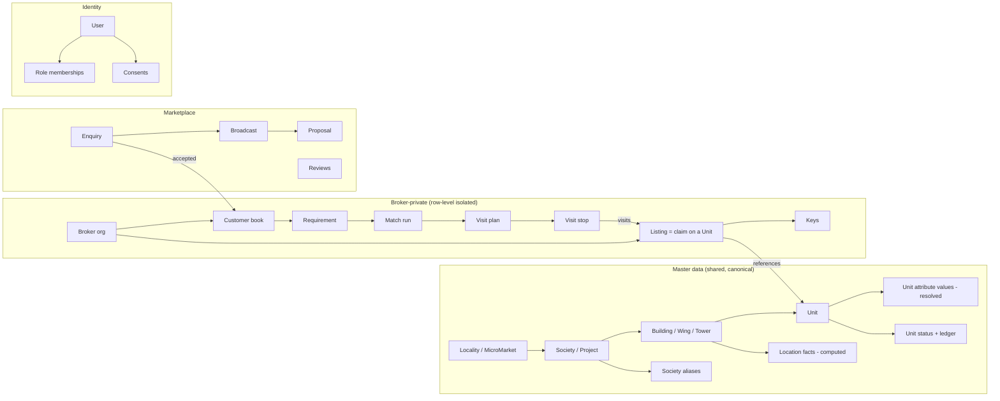
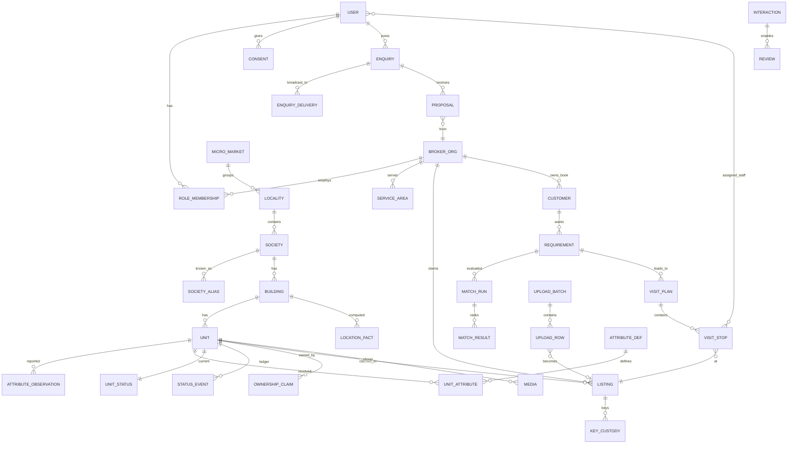
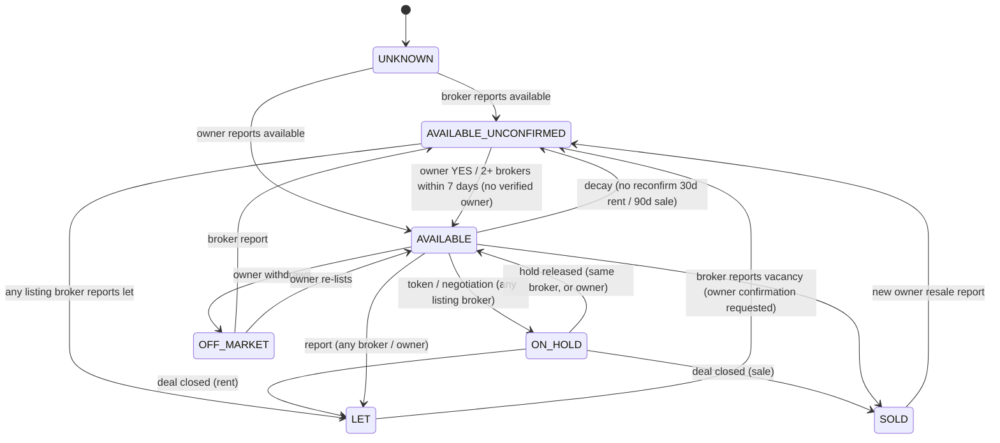

# 03 — Data Model

Database: **PostgreSQL 16 + PostGIS 3.4** (plus the `pg_trgm`, `unaccent`, `fuzzystrmatch` and
`btree_gist` extensions). Geometry is stored as `geography(Point,4326)` for distances and
`geometry(MultiPolygon,4326)` for areas.

Conventions: `id` = UUIDv7 (time-ordered) primary keys; `created_at` / `updated_at` timestamptz on
every table; soft delete via `archived_at` where history matters; money in **paise** (`bigint`);
areas in **sq ft** (`numeric(8,2)`); all enums are Postgres enums or lookup tables (noted).

---

## 1. Domain map

The model has four bounded contexts. The line between **Master** (shared truth) and **Broker
private** (claims) is the most important design decision in the system.



## 2. Entity-relationship diagram (core)



## 3. Table specifications

### 3.1 Identity and organisations

**`user`**

| Column | Type | Notes |
|--------|------|-------|
| id | uuid PK | |
| phone_e164_enc | bytea | AES-GCM encrypted (envelope key in KMS) |
| phone_hash | bytea UNIQUE | HMAC-SHA256(phone, pepper), used for lookup |
| display_name | text | |
| email_enc | bytea NULL | |
| preferred_lang | text | `en`, `hi`, `mr` |
| trust_score | smallint | 0–100 (customers: no-shows, reports) |
| status | enum | `active`, `suspended`, `deleted` |
| last_seen_at | timestamptz | |

**`broker_org`**: an agency; a solo broker is an org of one.

| Column | Type | Notes |
|--------|------|-------|
| id | uuid PK | |
| name | text | |
| office_location | geography(Point) | |
| office_address | text | |
| rera_agent_no | text NULL | e.g. MahaRERA `A5xxxxxxxxxx` |
| rera_verified_at | timestamptz NULL | |
| verification_status | enum | `pending`, `verified`, `rejected`, `suspended` |
| txn_types | text[] | subset of `RENT`, `SALE_NEW`, `SALE_RESALE` |
| languages | text[] | |
| plan_id | uuid FK → plan | |
| is_online | bool | derived from staff presence (cache) |
| rating_bayes | numeric(3,2) | denormalised reputation |
| rating_count | int | |
| median_response_s | int | |
| listing_accuracy | numeric(4,3) | 0–1 |

**`role_membership`**: `user_id`, `role` (`customer`, `broker_principal`, `broker_manager`,
`broker_staff`, `owner`, `builder_admin`, `platform_admin`, `platform_ops`), `broker_org_id` NULL,
`builder_org_id` NULL, `active_from`, `active_to`.

**`service_area`**: `broker_org_id`, `area geometry(MultiPolygon)`, `locality_id` NULL,
`txn_types text[]`. GiST index on `area`.

**`consent`**: `user_id`, `purpose` (`marketing`, `share_contact_with_broker`, `location_tracking`,
`whatsapp`), `version`, `granted_at`, `withdrawn_at`.

### 3.2 Master data

**`micro_market`**: `name` (e.g. "Thane West"), `city` ("MMR"), `boundary`, `launch_state` (`off`,
`pilot`, `live`), `config jsonb` (broadcast radius, lead limits, price bands).

**`locality`**: `micro_market_id`, `name` ("Dhokali"), `pincode[]`, `boundary`, `centroid`.

**`society`**: a housing society or builder project.

| Column | Type | Notes |
|--------|------|-------|
| id | uuid PK | |
| canonical_name | text | "Hiranandani Estate – Rodas Enclave" |
| name_normalised | text | output of `normalise_name()` (§5.2); GIN trigram index |
| name_phonetic | text | Double Metaphone of the normalised name |
| kind | enum | `chs`, `project`, `standalone_building`, `layout` |
| locality_id | uuid FK | |
| address_line | text | |
| pincode | char(6) | |
| location | geography(Point) | entrance/centroid; GiST index |
| boundary | geometry(MultiPolygon) NULL | |
| rera_project_nos | text[] | for projects |
| possession_date | date NULL | upcoming projects |
| status | enum | `provisional`, `active`, `merged`, `rejected` |
| merged_into_id | uuid NULL FK → society | tombstone pointer for merges |
| proposed_by_org_id | uuid NULL | provisional only |
| provenance | jsonb | sources + source IDs |

**`society_alias`**: `society_id`, `alias_raw`, `alias_normalised` (trigram index), `source`
(`seed`, `broker_upload`, `admin`, `search_click`), `confirmations int`, `created_by_org_id`.
Unique on `(alias_normalised, society_id)`.

**`building`**: `society_id`, `name` ("Wing B", "Tower 3", "Rodas-A"), `name_normalised`,
`location`, `floors_total`, `lowest_floor` (0 = flats on ground), `units_per_floor`, `skip_floors int[]` (refuge/podium), `extra_unit_nos text[]` (penthouses, 1203A), `layout_source`, `layout_verified`, `lifts`, `year_built`, `oc_received bool NULL`. Society carries `wings_complete` (every wing on record: brokers cannot add wings). See PRD MD-10.

**`unit`**: the physical flat or house. **One row per real unit.**

| Column | Type | Notes |
|--------|------|-------|
| id | uuid PK | |
| building_id | uuid FK | |
| unit_no | text | as painted on the door, e.g. "1203" |
| unit_no_normalised | text | stripped/upper-cased; unique with building |
| floor | smallint | |
| location | geography(Point) | defaults to the building's; override ≤ 150 m |
| property_type | enum | `apartment`, `row_house`, `independent_house`, `villa`, `penthouse` |
| bhk | numeric(3,1) | 1, 1.5, 2, 2.5, … ; 0.5 = 1RK |
| carpet_sqft | numeric(8,2) NULL | resolved value mirrored here for fast filtering |
| merged_into_id | uuid NULL | |

Unique index: `(building_id, unit_no_normalised) WHERE merged_into_id IS NULL`.

**`attribute_def`**: the dictionary, so admins can add attributes without code. The initial
content is the founder-approved **Unit Attribute Dictionary v1.0** (200 attributes in 13
categories, approved 2026-09-23), committed as `attribute_dictionary.yaml` and loaded with
`manage.py load_attribute_dictionary`. The list below
shows the columns; the full list is in that file.

| Column | Type | Notes |
|--------|------|-------|
| key | text PK | `pets_allowed`, `furnishing`, `has_gas_stove`, `has_kitchen_cabinet`, `nonveg_allowed`, `bachelors_allowed`, `facing`, `parking_covered`, `lift`, … |
| label_i18n | jsonb | |
| value_type | enum | `bool`, `enum`, `int`, `numeric`, `text`, `multi_enum` |
| allowed_values | jsonb | for enums |
| category | enum | `physical`, `amenity`, `furnishing_item`, `house_rule`, `legal`, `location_fact` |
| authority | enum | `computed`, `owner`, `any` (who is authoritative, §6) |
| scope | enum | `unit`, `building`, `society` (e.g. `lift` is building-level) |
| is_public | bool | shown on public cards |
| is_matchable | bool | usable in matching |

**`attribute_observation`**: every report of a value, from anyone (append-only).

| Column | Type | Notes |
|--------|------|-------|
| id | uuid PK | |
| subject_type / subject_id | enum / uuid | unit / building / society |
| attr_key | text FK | |
| value | jsonb | |
| source_type | enum | `computed`, `owner_verified`, `admin`, `visit_feedback`, `broker`, `customer`, `upload` |
| source_actor_id | uuid NULL | user or org, **never exposed to other brokers** |
| confidence | numeric(3,2) | |
| observed_at | timestamptz | |

**`unit_attribute`**: the **resolved** value (materialised by the resolver, §6).
`subject_type`, `subject_id`, `attr_key`, `value jsonb`, `resolved_source_type`, `support`
(number of agreeing observations), `disputed bool`, `resolved_at`. PK
`(subject_type, subject_id, attr_key)`.

**`location_fact`**: computed per building from the POI dataset. `building_id`, `poi_type`
(`rail_station`, `metro_station`, `auto_stand`, `bus_stop`, `school`, `hospital`, `market`,
`highway`), `poi_id`, `poi_name`, `distance_m`, `walk_min`, `drive_min`, `computed_at`.

**`poi`**: `type`, `name`, `location`, `source` (OSM / admin / Google), `verified bool`.

**`ownership_claim`**: `unit_id`, `user_id`, `share_pct`, `proof_type`, `proof_media_id`,
`status` (`pending`, `verified`, `rejected`, `revoked`), `verified_by`, `verified_at`.

**`media`**: `owner_type/owner_id` (unit / listing / society), `kind` (`photo`, `video`,
`floor_plan`, `document`), `storage_key`, `hls_key`, `visibility` (`private_org`, `master_public`),
`uploaded_by`, `exif_stripped bool`.

### 3.3 Unit status (see §4 for the state machine)

**`unit_status`**: one row per unit (current state). `unit_id` PK, `txn_type` (a unit can be
listed for rent *and* sale; the PK becomes `(unit_id, txn_type)`), `state` enum, `since`,
`source_type`, `confirmed_by_owner bool`, `available_from date NULL`, `licence_end_date date NULL`,
`version int` (optimistic locking).

**`status_event`**: **append-only, hash-chained ledger**.

| Column | Type | Notes |
|--------|------|-------|
| seq | bigserial PK | |
| unit_id, txn_type | | |
| from_state, to_state | enum | |
| actor_type | enum | `broker`, `owner`, `system`, `admin`, `consensus` |
| actor_id | uuid | |
| reason | text | |
| pending_confirmation_id | uuid NULL | |
| prev_hash | bytea | |
| hash | bytea | SHA-256(prev_hash ‖ canonical_json(row)) |

A trigger forbids `UPDATE`/`DELETE` (same pattern as the existing audit module in this repo).

**`status_confirmation`**: `id`, `unit_id`, `txn_type`, `requested_state`, `requested_by_org_id`,
`owner_user_id`, `token_hash`, `expires_at`, `response` (`yes`, `no`, `available_from`),
`responded_at`, `channel`.

### 3.4 Broker-private data (row-level security on `broker_org_id`)

**`listing`**: a broker's claim on a unit.

| Column | Type | Notes |
|--------|------|-------|
| id | uuid PK | |
| broker_org_id | uuid FK | **RLS key** |
| unit_id | uuid FK | |
| txn_type | enum | `RENT`, `SALE_NEW`, `SALE_RESALE` |
| asking_rent_paise / asking_price_paise | bigint NULL | |
| deposit_paise | bigint NULL | |
| maintenance_paise | bigint NULL | |
| negotiable | bool | |
| available_from | date | |
| brokerage_terms | text | |
| owner_contact_enc | bytea NULL | |
| origin | enum | `manual`, `upload`, `owner_invite`, `builder` |
| listing_state | enum | mirrors master state from this broker's view + `withdrawn_by_owner`, `archived` |
| last_confirmed_at | timestamptz | drives staleness |
| visibility | enum | `private`, `publish_card` (aggregate map always; card only if chosen) |
| private_notes | text | |

Unique `(broker_org_id, unit_id, txn_type) WHERE archived_at IS NULL`.

**`key_custody`**: `listing_id`, `holder_type` (`owner`, `office`, `staff`, `society_office`,
`lockbox`), `holder_user_id` NULL, `instructions_enc`, `from_ts`, `to_ts`.

**`customer`** (broker's book): `broker_org_id` (RLS), `phone_hash`, `phone_enc`, `name`,
`source` (`marketplace`, `phone_call`, `walk_in`, `referral`, `board`, `whatsapp_group`,
`import`, `other`), `platform_user_id NULL` (set when an offline customer claims their profile),
`consent_state` (`none`, `attested_verbal`, `otp_confirmed`, `link_confirmed`, `withdrawn`),
`consent_evidence jsonb`, `stage`, `tags[]`, `notes`.

**`customer_interaction`** (offline + online touchpoints, OFF-07): `broker_org_id` (RLS),
`customer_id`, `kind` (`call_in`, `call_out`, `office_meeting`, `whatsapp`, `sms`, `link_opened`,
`shortlist_response`, `note`), `occurred_at`, `duration_s`, `summary`, `by_user_id`.

**`share_link`** (shortlist, visit plan, review, consent, status confirmation): `id`,
`purpose`, `token_hash`, `target_type/target_id`, `recipient_phone_hash`, `expires_at`,
`max_uses`, `uses`, `revoked_at`. Tokens are shown once and never stored in clear.

**`shortlist`** / **`shortlist_item`**: `broker_org_id` (RLS), `customer_id`, `requirement_id`,
items → `listing_id`, `customer_response` (`interested`, `not_for_me`, `null`), `responded_at`.

**`sync_mutation`** (offline field app, OFF-10/11): `device_id`, `user_id`, `idempotency_key`
UNIQUE, `entity`, `payload`, `client_ts`, `applied_at`, `result` (`applied`, `duplicate`,
`conflict`), `conflict_detail`.

**`requirement`**: `broker_org_id` (RLS; NULL for the customer's own enquiry copy), `customer_id`,
`enquiry_id NULL`, `txn_type`, `property_types[]`, `bhk_min/max`, `budget_min/max_paise`,
`search_area geometry`, `anchor_points` (office / school to be near), `move_in_by`,
`must_haves jsonb` (attr_key → required value), `nice_to_haves jsonb`, `house_rule_needs jsonb`
(e.g. `{"pets": "dog", "nonveg_cooking": true}`), `occupants`, `notes`, `version` (every edit
creates a new version so mid-tour changes are traceable).

**`match_run`** / **`match_result`**: run → `(listing_id, score, explanation jsonb, excluded bool,
exclusion_reasons[])`.

**`visit_plan`**: `broker_org_id` (RLS), `customer_id`, `requirement_id`, `date`,
`start_point geography`, `travel_mode`, `state` (`draft`, `shared`, `customer_confirmed`,
`in_progress`, `completed`, `cancelled`), `share_token_hash`, `route_polyline`, `version`.

**`visit_stop`**: `plan_id`, `seq`, `listing_id`, `slot_start`, `slot_end`, `assigned_staff_id`,
`staff_ack_at`, `owner_notice_state` (`not_required`, `sent`, `acknowledged`, `declined`),
`checkin_at`, `checkout_at`, `outcome` (`liked`, `rejected`, `shortlisted`, `second_visit`,
`no_show`, `not_accessible`), `reject_reasons[]`, `feedback_note`.

### 3.5 Marketplace

**`enquiry`**: `customer_user_id`, the same structured fields as `requirement`, `summary_text`
(generated), `urgency` (`normal`, `urgent`), `state` (`open`, `in_progress`, `fulfilled`,
`cancelled`, `expired`), `expires_at`, `broadcast_radius_m`, `moderation_state`.

**`enquiry_delivery`**: `enquiry_id`, `broker_org_id`, `channel` (`ws`, `push`, `whatsapp`),
`delivered_at`, `seen_at`, `match_count_snapshot`. Unique `(enquiry_id, broker_org_id)`.

**`proposal`**: `enquiry_id`, `broker_org_id`, `message`, `brokerage_terms`, `match_count`,
`earliest_slot`, `teaser_society_ids[]`, `state` (`sent`, `accepted`, `declined`, `expired`,
`withdrawn`), `credit_txn_id NULL`, `promoted bool`. Unique `(enquiry_id, broker_org_id)`.

**`interaction`**: a verified relationship that makes reviews possible. `kind` (`visit_completed`,
`deal_closed`, `owner_representation`), `party_a`, `party_b`, `ref_id`, `occurred_at`.

**`review`**: `interaction_id`, `reviewer_user_id`, `reviewee_type` (`broker_org`, `user`,
`unit`), `reviewee_id`, `direction` (`C2B`, `B2C`, `O2B`, `B2O`, `C2U`), `stars`, `tags[]`,
`text`, `moderation_state`, `reply_text`. Unique `(interaction_id, reviewer_user_id, direction)`.

### 3.6 Uploads

**`upload_batch`**: `broker_org_id`, `file_media_id`, `column_mapping jsonb`, `state` (`parsing`,
`resolving`, `awaiting_review`, `committed`, `failed`), counters.

**`upload_row`**: `batch_id`, `row_no`, `raw jsonb`, `parsed jsonb`, `society_candidates jsonb`
(id, score, reasons), `resolved_society_id`, `resolved_building_id`, `resolved_unit_id`,
`resolution` (`auto`, `broker_confirmed`, `provisional`, `error`), `errors[]`, `listing_id`.

### 3.7 Billing, notifications, audit (summary)

- `plan`, `subscription`, `credit_wallet`, `ledger_entry` (double-entry: `account`, `debit`,
  `credit`, `ref`), `invoice` (GST fields).
- `notification` (`user_id`, `template`, `channel`, `payload`, `state`, `attempts`,
  `provider_msg_id`).
- `audit_event`: generic hash-chained audit for admin actions, merges, verifications,
  permission changes and billing (the same design as `society/audit_emitter.py` in this repo,
  ported, not imported).

## 4. Unit status state machine



**Rules**

1. *Downgrades are cheap, upgrades are expensive.* Any listing broker can make a unit
   less available at once. Making it available again after LET/SOLD/OFF_MARKET needs the owner
   (or broker consensus when there is no verified owner).
2. *Owner beats broker.* A verified owner's statement overrides broker reports. Repeated
   contradictions send the broker's listing to admin review and lower their `listing_accuracy`.
3. *Visit evidence counts.* A visit outcome of `not_accessible` or "already let (told by
   watchman)" is recorded as a `visit_feedback` observation and can trigger a downgrade.
4. Every transition writes a `status_event` in the same transaction as the `unit_status` update,
   with `SELECT … FOR UPDATE` on the unit row and a version check.
5. Other brokers with listings on the unit are notified of state changes **without learning who
   made the change**.
6. *Holds belong to the broker who placed them.* While a unit is `ON_HOLD` (token / negotiation),
   another broker's "available" report does not release it. Only the holding broker or the owner
   can, and a hold expires to `AVAILABLE_UNCONFIRMED` after 7 days (configurable).

## 5. Society and building de-duplication

### 5.1 The problem
Broker uploads contain "Hiranandani Estate", "Hira Nandani Est.", "HE – Rodas", "Rodas Enclave
Thane" and "Rodas Encl., Ghodbunder Rd". They are all the same place. A naive import creates five
societies and corrupts the master.

### 5.2 Normalisation `normalise_name(raw)`
1. Unicode NFKC, lower-case, `unaccent`, transliterate Devanagari → Latin (for Marathi/Hindi input).
2. Expand/strip common tokens with a curated dictionary:
   `chs`, `co-op hsg soc`, `cooperative housing society`, `soc`, `society`, `apts`,
   `apartment(s)`, `bldg`, `building`, `twr`, `tower`, `wing`, `phase`, `ph`, `complex`,
   `enclave → encl`, `nagar`, `park`, `heights`, `residency`… Generic words are kept as **weak
   tokens** (they carry little weight in scoring) rather than removed.
3. Remove punctuation; collapse spaces; split joined words by dictionary ("hiranandani" ≈ "hira nandani").
4. Separate **locality tokens** ("thane", "ghodbunder rd", "kharghar sec 20") into a locality hint.
5. Extract **wing/building tokens** ("B wing", "Tower 3", "A-") into a building hint.

### 5.3 Candidate generation
For an upload row with normalised name `n`, locality hint `h`, optional pin code/address/coordinates:

- **Alias exact:** `society_alias.alias_normalised = n` → candidate with prior 0.95 (the strongest signal).
- **Trigram:** `similarity(name_normalised, n) > 0.35` (GIN index), top 20.
- **Phonetic:** `dmetaphone(n) = name_phonetic`.
- **Geo:** societies within 1.5 km of geocoded coordinates / the pin-code centroid / the locality centroid.

### 5.4 Scoring
```
score = 0.40·name_sim          (max of trigram, token-set Jaro-Winkler on strong tokens)
      + 0.20·alias_signal      (1 if exact alias, 0.5 if alias trigram > 0.8)
      + 0.20·geo_score         (1 − distance/1500 m, floored at 0; 0.5 if no location)
      + 0.10·locality_match    (hint ∈ society locality or aliases)
      + 0.10·pincode_match
```
Signals that are missing for a row (no coordinates, no pin code, no confirmed alias) are left
out of the weighted average rather than counted as zero, and the name is compared against the
canonical name **and every learned alias**. A strong location match can never rescue a different
name (score is capped at name + 0.15). A locality hint only counts when it names a real locality
("Thane" is a city, not a locality).

Thresholds (tunable per micro-market):

| Score | Action |
|-------|--------|
| ≥ 0.90 and runner-up gap ≥ 0.10 | **Auto-match**; add alias; row → `auto` |
| 0.60 – 0.90, and name similarity ≥ 0.75 | **Broker confirms** from the top 3 candidates (map + photo); confirmation adds an alias |
| < 0.60 | **Provisional society** proposal → admin queue (with nearest candidates shown to the admin) |

The same scoring runs for the building (within the society) and unit number normalisation
("1203", "12/03", "B-1203", "Flat 1203, 12th flr" → `B`, `1203`, floor 12).

### 5.5 Merge
Admin merges duplicate `society` X into Y. In one transaction: re-point buildings and units (merge
duplicate buildings/units recursively), move aliases (X's name becomes an alias of Y), set
`X.status = merged, merged_into_id = Y`, write the audit event. API reads follow `merged_into_id`
so old links keep working. Undo is possible within 30 days using the audit payload.

### 5.6 Feedback loop
Every broker confirmation and admin decision becomes an alias with `confirmations += 1`. Over
time most uploads auto-match. Target: ≥ 85% auto-match by month 3 of a micro-market.

## 6. One unit, one truth: attribute resolution

### 6.1 Principle
**Facts are computed or owned; opinions are not master data.**

| Attribute class | Examples | Authority | Resolution |
|-----------------|----------|-----------|-----------|
| **Computed** | Distance to station / auto stand / school; walk time | System (from coordinates + POI data) | Always the computed value; brokers *cannot* override. "Close to station" vs "far from station" disappears: the unit shows "650 m / 8 min walk to Thane station" |
| **Owner-authoritative** | Pets allowed, house rules, furnishing items, expected rent | Verified owner | Owner value wins; if no owner, fall back to evidence weighting |
| **Physical (verifiable)** | BHK, carpet area, floor, facing, parking | Owner / admin / visit evidence | Weighted consensus |
| **Building/society-level** | Lift, gym, pool, power backup, society pet policy | Admin / society (P3) / consensus | Weighted consensus at building scope; inherited by units |
| **Subjective** | "Good ventilation", "quiet", "nice view" | Nobody | Not master data; kept as review tags or listing notes |

### 6.2 Evidence weighting
For each `(subject, attr)` the resolver groups observations by value and scores each value:

```
weight(obs) = source_weight[source_type]
            × actor_reliability(actor)       # broker listing_accuracy, customer trust, etc. (0.5–1.2)
            × recency_decay(observed_at)     # half-life 180 d physical, 30 d house rules
source_weight: computed 10, owner_verified 8, admin 6, visit_feedback 3, broker 2, upload 1.5, customer 1
```

The value with the highest total weight wins. **`disputed = true`** when the runner-up has ≥ 40% of
the winner's weight *and* at least 2 independent actors support it. Disputed attributes appear in
the admin queue and are shown with a "reported differently by some sources" marker. Matching treats a
disputed hard constraint as a *soft* one (it is shown, not used to exclude).

### 6.3 Worked example
Unit 1203, "near station?". Broker A: "close". Broker B: "very far". Old model: conflict. New
model: `near_station` is **not** an attribute. The `location_fact` says 1.9 km / 24 min walk / 6 min
by auto. The customer's requirement "not too far from station" becomes "≤ 1.5 km or ≤ 8 min by
auto", which is set when the enquiry is created, and matching is objective.

Unit 1203, "pets allowed?". Broker A (accuracy 0.9): yes, 10 days ago. Broker B (accuracy 0.6): no,
200 days ago. Owner not on platform. With the 30-day half-life for house rules, the weights are
A = 2×0.9×0.79 ≈ 1.43 and B = 2×0.6×0.01 ≈ 0.01. Resolved **yes**, not disputed. When the owner later confirms "no", the value
is **no** at once (weight 8).

## 7. Row-level security (inventory isolation)

Broker-private tables (`listing`, `key_custody`, `customer`, `requirement`, `match_run`,
`match_result`, `visit_plan`, `visit_stop`, broker-scoped `media`) have:

```sql
ALTER TABLE listing ENABLE ROW LEVEL SECURITY;
ALTER TABLE listing FORCE ROW LEVEL SECURITY;
CREATE POLICY listing_isolation ON listing
  USING (broker_org_id = current_setting('app.broker_org_id', true)::uuid)
  WITH CHECK (broker_org_id = current_setting('app.broker_org_id', true)::uuid);
```

The API sets `SET LOCAL app.broker_org_id = …` at the start of every request transaction from the
authenticated membership. A separate DB role `svc_platform` (with `BYPASSRLS`) is used **only** by
system jobs that need cross-broker aggregates (map clusters, status notifications, consensus), and
those jobs only ever emit aggregates or anonymised notifications. A CI test suite tries
cross-tenant reads and writes on every private table and must see zero rows.

Staff-level restriction (assigned stops only) is enforced in the application layer on top of RLS.

## 8. Aggregates for the customer map

The public map never reads `listing` directly. A materialised table `geo_supply_cell` is refreshed
incrementally (on status or listing change, via outbox events, debounced 60 s):

| Column | Notes |
|--------|-------|
| h3_index | H3 cell at resolutions 7/8/9 (zoom-dependent) |
| txn_type, bhk_bucket | |
| units_available | count of distinct units with ≥ 1 active listing in `AVAILABLE`/`AVAILABLE_UNCONFIRMED` |
| price_p25 / p50 / p75 | from asking prices, **only if ≥ 5 units in the cell** (k-anonymity) |
| brokers_serving | distinct verified orgs whose service area covers the cell |
| brokers_online | from the presence cache (Redis), merged at read time |

## 9. Indexing and partitioning highlights

- GiST: every `location`, `boundary` and `service_area.area`; `requirement.search_area`.
- GIN trigram: `society.name_normalised`, `society_alias.alias_normalised`, `building.name_normalised`.
- B-tree composite: `listing (broker_org_id, listing_state, txn_type)`,
  `unit_status (state, txn_type)`, `enquiry (state, created_at)`.
- Partition by month: `status_event`, `audit_event`, `notification`, `enquiry_delivery`.
- Outbox table `domain_event` (transactional outbox) → Celery relay → Redis Streams / WebSocket.

## 10. Data retention (DPDP-aligned; to be confirmed with counsel)

| Data | Retention |
|------|-----------|
| Enquiries (customer PII) | 12 months after closure, then anonymised |
| Broker customer book | While the broker account is active + 90 days; the broker is the data fiduciary for their book, the platform the processor (confirm in contracts) |
| Status ledger, audit | 8 years (tax/legal defensibility); PII inside is pseudonymised |
| Staff live location | 7 days |
| OTP logs | 90 days |
| Media of withdrawn listings | 180 days |
