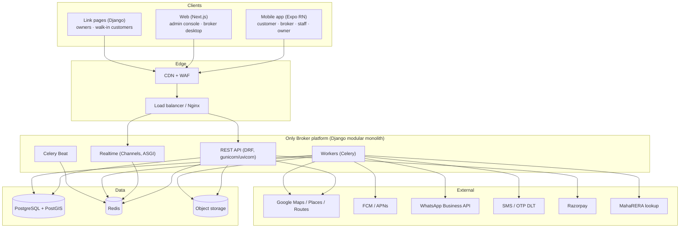
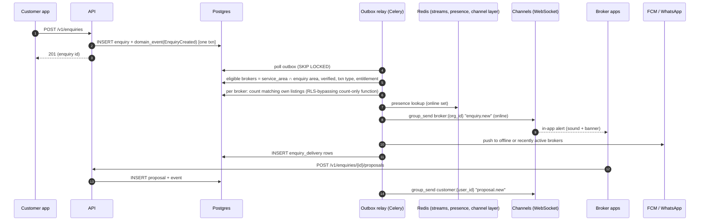
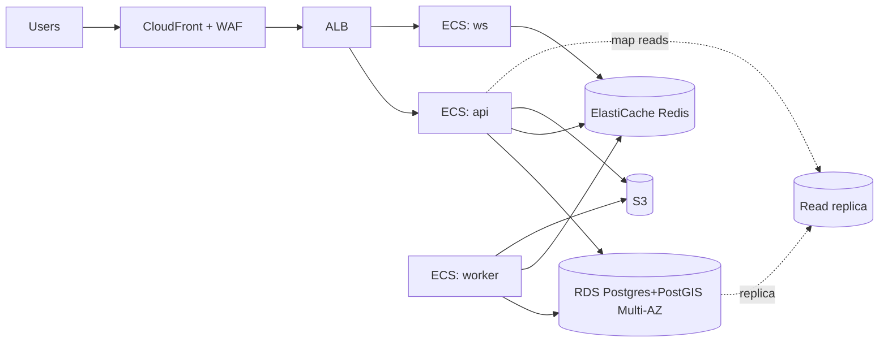

# 04 — Architecture & Infrastructure

## 1. Architecture principles

1. **Modular monolith first.** One Django codebase with clear internal modules (the bounded
   contexts in the Data Model). Microservices would slow a small team down. The *real-time* path
   and *workers* run as separate processes of the same codebase, so they scale independently.
2. **The database enforces privacy.** Broker isolation uses PostgreSQL row-level security, not
   just ORM filters.
3. **Geo-native.** PostGIS for all spatial work; H3 cells for aggregation.
4. **Event-driven side effects.** Writes produce domain events through a transactional outbox, and
   notifications, aggregates and search updates consume them. No dual writes.
5. **Same stack on the laptop and in production.** Docker Compose on the laptop mirrors the
   production services one for one.
6. **India-resident data.** Production hosted in an India region.

## 2. Technology choices

| Layer | Choice | Why |
|-------|--------|-----|
| API / domain | **Python 3.12, Django 5.x, Django REST Framework, GeoDjango** | The team already runs Django (this repo); GeoDjango + PostGIS is mature; strong admin for early ops |
| Real-time | **Django Channels 4 + Daphne/Uvicorn** (ASGI), Redis channel layer | WebSockets for enquiry alerts, proposals, live visit updates |
| Async jobs | **Celery 5 + Redis** (broker), Celery Beat (schedules) | Uploads, resolver, notifications, decay jobs, aggregates |
| Database | **PostgreSQL 16 + PostGIS 3.4**, pg_trgm, fuzzystrmatch, h3-pg | Geo + fuzzy + RLS in one engine |
| Cache / presence / pub-sub | **Redis 7** | Broker presence with TTL, rate limits, channel layer, Redis Streams for fan-out |
| Search (Phase 2 if needed) | **Meilisearch** or OpenSearch | Typo-tolerant society search at scale; Phase 1 uses Postgres trigram |
| Object storage | **S3** (prod) / **MinIO** (laptop) | Photos, videos, uploads; presigned URLs |
| Video | AWS MediaConvert (prod) / ffmpeg worker (dev) → HLS | Owner walkthrough videos |
| Mobile app | **React Native (Expo, TypeScript)**: one app with customer / broker / staff / owner modes | One codebase for Android and iOS; OTA updates; shared TypeScript types with the web |
| Web (admin + broker desktop) | **Next.js 15 (React, TypeScript)** + a component library (shadcn/ui) + MapLibre GL | Desktop consoles |
| Owner/customer link pages | **Server-rendered Django templates** (`apps.linkpages`) | Opened from WhatsApp/SMS on any phone: no JavaScript needed, small pages for slow connections, same address as the API so no extra deployment (decided 2026-09-24) |
| Maps | **Google Maps Platform** (Places autocomplete, geocoding, Routes API with waypoint optimisation) on mobile; **MapLibre + OSM tiles** on the admin console to control cost | Google has the best Indian address and POI coverage; OSM is enough for internal tools |
| Push | Firebase Cloud Messaging (Android + iOS via APNs) | |
| WhatsApp | WhatsApp Business Cloud API (Meta) directly, or via a BSP (Gupshup / Interakt / AiSensy) | Template messages for owner confirmation, visit notices |
| SMS / OTP | MSG91 or Exotel (DLT-registered) | OTP + fallback |
| Masked calling (P1) | Exotel / Knowlarity virtual numbers | |
| Payments (P1) | Razorpay | UPI, cards, subscriptions, GST invoices |
| KYC (P1) | DigiLocker (via an aggregator), PAN verification API | Broker/owner verification |
| Observability | OpenTelemetry → Grafana stack (Loki, Tempo, Prometheus) or a managed APM; Sentry for errors | |
| IaC / CI | Terraform, GitHub Actions, Docker | |

**Other options considered.** Node/NestJS: rejected because it gives up the team's Django
experience and GeoDjango. Flutter: a viable alternative to React Native; React Native was chosen
for code and type sharing with the Next.js consoles. Firebase-only backend: rejected because
row-level isolation, geo queries and relational integrity are core to this product.

## 3. System context



## 4. Code structure (backend)

```
broker-only/
  backend/
    config/                 # settings (base/dev/prod), asgi, urls, celery
    apps/
      identity/             # users, OTP, roles, consents, devices
      orgs/                 # broker orgs, staff, service areas, verification
      masterdata/           # locality, society, alias, building, unit, attributes, POI, location facts
        resolver/           # attribute resolution engine (§6 of the data model)
        dedupe/             # normalisation, candidate generation, scoring, merge
      status/               # unit status state machine, confirmations, ledger
      inventory/            # listings, keys, uploads (staging + resolution)
      crm/                  # customers, requirements
      matching/             # hard filters, scoring, explanations
      visits/               # plans, stops, routing, assignment, outcomes
      marketplace/          # enquiries, broadcast, proposals, presence, map aggregates
      reviews/              # interactions, reviews, reputation
      linkpages/            # WhatsApp/SMS link pages for owners and offline customers
      notifications/        # templates, channels, preferences, delivery log
      billing/              # plans, entitlements, wallet, ledger, invoices
      audit/                # hash-chained audit + verification
      adminops/             # queues, DPDP desk, dashboards APIs
    common/                 # outbox, RLS middleware, encryption fields, pagination, errors
    tests/
  mobile/                   # Expo app
  web/                      # Next.js (admin + broker desktop)
  infra/
    docker/                 # Dockerfiles
    compose/                # docker-compose.dev.yml
    terraform/              # production
  docs/
```

Module rules: modules call each other only through a `services.py` public interface. They never
reach into another module's models for writes. Cross-module side effects go through domain events.

## 5. Key flows (technical)

### 5.1 Enquiry broadcast (the "beep" path)



- **Eligibility query** (PostGIS): `ST_Intersects(service_area.area, enquiry.search_area)` plus
  filters, capped at N brokers (default 200). The cap favours rating, response time and
  proximity, with a random fairness slice (e.g. 20%) so new brokers get a chance.
- **Match count per broker** uses a `SECURITY DEFINER` SQL function that returns only an integer
  count per org, never rows, so privacy holds.
- **Latency budget:** outbox relay polls every 250 ms (or uses `LISTEN/NOTIFY`); fan-out < 3 s for
  500 brokers.

### 5.2 Presence
Broker app sends a WebSocket heartbeat every 60 s → Redis `SETEX presence:{org}:{user} 600`. A
sorted set per H3 res-7 cell holds online orgs for fast map reads. Toggling "offline" deletes the key.

### 5.3 Visit route optimisation
`POST /v1/visit-plans/{id}/optimize` → the worker calls the Google Routes API
(`optimizeWaypointOrder=true`, up to 25 waypoints) with travel mode and departure time → stores
the order, polyline, ETAs → pushes `visit_plan.updated` to the assigned staff and the customer.
If the external call fails, fall back to a local nearest-neighbour ordering on PostGIS distances.

### 5.4 Owner confirmation link
The worker creates `status_confirmation` with a random 32-byte token, stores only
`sha256(token)`, and sends a WhatsApp template with `https://<server>/c/{token}`. The server-rendered page
(`apps.linkpages`) applies the answer (rate-limited, one-time, 72 h expiry). The response
applies the state transition in one transaction with the ledger append.

### 5.5 Bulk upload pipeline
Upload to S3 via presigned URL → `upload_batch` → the worker parses (openpyxl / pandas) → applies
the column mapping → normalises → dedupe candidates (§5 of the data model) → writes
`upload_row` → the broker reviews → commit creates listings and attribute observations in chunks
of 200 → the resolver re-computes affected attributes → outbox events refresh map cells.

## 6. API design

- REST, JSON, versioned `/v1`. OpenAPI 3.1 generated by drf-spectacular; TypeScript client
  generated for mobile and web.
- Auth: OTP → short-lived **JWT access token** (15 min) + rotating **refresh token** (30 days,
  device-bound, revocable). The active role and org are carried in the token claims and verified
  against memberships on every request.
- Pagination: cursor-based. Idempotency: an `Idempotency-Key` header on POSTs from mobile (retries
  on patchy networks).
- Errors: RFC 9457 problem+json.

### 6.1 Endpoint inventory (MVP)

| Area | Endpoints |
|------|-----------|
| Auth | `POST /auth/otp/request`, `POST /auth/otp/verify`, `POST /auth/token/refresh`, `POST /auth/logout`, `GET /me`, `PATCH /me`, `POST /me/role` |
| Orgs | `POST /broker-orgs`, `GET/PATCH /broker-orgs/{id}`, `POST /broker-orgs/{id}/staff`, `DELETE /broker-orgs/{id}/staff/{uid}`, `PUT /broker-orgs/{id}/service-areas`, `POST /presence` |
| Master data | `GET /societies/search?q=&near=`, `GET /societies/{id}`, `GET /societies/{id}/buildings`, `GET /buildings/{id}/units`, `POST /societies/proposals`, `GET /attributes/dictionary`, `POST /units/{id}/attribute-suggestions` |
| Inventory | `GET/POST /listings`, `GET/PATCH /listings/{id}`, `POST /listings/{id}/reconfirm`, `PUT /listings/{id}/keys`, `POST /uploads`, `GET /uploads/{id}`, `GET /uploads/{id}/rows?resolution=`, `POST /uploads/{id}/rows/{rid}/resolve`, `POST /uploads/{id}/commit` |
| Status | `POST /units/{id}/status-reports`, `GET /units/{id}/status`, `POST /public/confirmations/{token}` |
| CRM | `GET/POST /customers`, `GET /customers/{id}/timeline`, `POST /customers/{id}/requirements`, `PATCH /requirements/{id}` |
| Matching | `POST /requirements/{id}/match-runs`, `GET /match-runs/{id}` |
| Visits | `POST /visit-plans`, `GET/PATCH /visit-plans/{id}`, `POST /visit-plans/{id}/optimize`, `POST /visit-plans/{id}/share`, `POST /visit-plans/{id}/stops/{sid}/assign`, `POST /visit-stops/{sid}/checkin`, `POST /visit-stops/{sid}/outcome`, `GET /public/visit-plans/{token}` |
| Marketplace | `GET /map/supply?bbox=&zoom=&txn=&bhk=&budget=`, `POST /enquiries`, `GET /enquiries/{id}`, `PATCH /enquiries/{id}`, `GET /enquiries/{id}/proposals`, `POST /enquiries/{id}/proposals`, `POST /proposals/{id}/accept`, `GET /broker/leads` |
| Reviews | `POST /interactions/{id}/reviews`, `GET /broker-orgs/{id}/reviews` |
| Admin | `/admin-api/verifications`, `/admin-api/societies/{id}/merge`, `/admin-api/queues/*`, `/admin-api/micro-markets`, `/admin-api/audit/verify`, `/admin-api/dpdp/*` |

### 6.2 WebSocket channels
`wss://…/ws/?token=…`. Server-side groups: `broker:{org_id}`, `user:{user_id}`,
`visit_plan:{id}`. Message types: `enquiry.new`, `enquiry.closed`, `proposal.new`,
`proposal.accepted`, `visit_plan.updated`, `visit_stop.assigned`, `status.changed` (anonymised),
`notification`.

## 7. Security architecture

| Concern | Control |
|---------|---------|
| Tenant isolation | Postgres RLS on broker-private tables; per-request `SET LOCAL app.broker_org_id`; CI cross-tenant tests |
| PII | Field-level encryption (AES-256-GCM, envelope keys in AWS KMS) for phones, owner contacts, key instructions; HMAC lookups |
| AuthN | OTP (rate-limited, device fingerprint), JWT (RS256, key rotation), refresh-token rotation with reuse detection |
| AuthZ | Role + org membership checks in DRF permission classes; object-level checks for staff assignments |
| Public links | Random 256-bit tokens, hashed at rest, single-use or expiring, rate-limited, no PII in URLs |
| Uploads | Size/type limits, antivirus scan (ClamAV worker), formula stripping from Excel (CSV-injection protection on export) |
| Media | Private bucket; presigned GET with short TTL; EXIF stripped from public copies |
| Web | CSP, HSTS, SameSite cookies for the web console, CSRF on cookie auth |
| Abuse | Per-IP/phone/org rate limits (Redis token bucket); moderation of free text (profanity + identity-discrimination classifier + keyword rules) |
| Secrets | `.env` only on the laptop (never committed); AWS Secrets Manager in production |
| Audit | Hash-chained audit for admin, merge, verification, status, billing, permission changes |
| Backups | PITR on the database (7–35 days), daily snapshots copied to a second region *within India* (Hyderabad ap-south-2) |

## 8. Environments

| Env | Where | Purpose |
|-----|-------|---------|
| `local` | **Your laptop** (Docker Compose) | Development, demo on the LAN, phone testing via tunnel |
| `staging` | Cloud (small) | Integration with real WhatsApp/SMS sandbox, UAT with pilot brokers |
| `prod` | Cloud (India region) | Live |

### 8.1 Laptop as dev server

**Requirements:** 16 GB RAM (8 GB minimum), 30 GB free disk, Docker Desktop (Windows: WSL2
backend; macOS: Apple silicon fine) or Docker Engine on Linux, Node 20 LTS, Python 3.12, Git.

**Services (`infra/compose/docker-compose.dev.yml`):**

| Service | Image | Port |
|---------|-------|------|
| `db` | `postgis/postgis:16-3.4` | 5432 |
| `redis` | `redis:7-alpine` | 6379 |
| `minio` | `minio/minio` | 9000 / 9001 (console) |
| `api` | local Dockerfile (Django, `runserver` / uvicorn with reload) | 8000 |
| `ws` | same image, Daphne/Uvicorn ASGI | 8001 |
| `worker` | same image, `celery worker` | – |
| `beat` | same image, `celery beat` | – |
| `web` | Next.js dev server | 3000 |
| `mailpit` | `axllent/mailpit` (captures email) | 8025 |

The mobile app runs via `npx expo start` on the laptop; a phone with **Expo Go** or a dev build
connects over the LAN.

**Letting phones and pilot brokers reach the laptop:**
- Same Wi-Fi: use the laptop's LAN IP (e.g. `http://192.168.1.20:8000`).
- Outside the LAN (pilot brokers in the field): **Cloudflare Tunnel** (`cloudflared`) or ngrok,
  which gives an HTTPS URL without opening router ports. Restrict it to a named hostname, and
  protect staging data with Cloudflare Access where possible.
- WhatsApp/SMS webhooks in dev also go through the tunnel URL.

**Laptop hygiene:** full-disk encryption on; do not load real customer PII on the laptop (use the
seed and faker data; the pilot uses staging); nightly `pg_dump` of the dev database to an
encrypted folder; power settings that keep the machine awake while serving demos.

**Dev seed:** `make seed` loads the Thane West micro-market, localities, ~300 real society names
(public sources), POIs (stations, auto stands, schools from OSM extracts), synthetic units,
brokers, listings and customers, so every flow can be demoed offline.

### 8.2 Production (Phase 1 → Phase 2)

**Phase 1 (pilot, low cost, ~₹25–40k/month):** AWS ap-south-1 (Mumbai)
- 1 × EC2 / Lightsail (4 vCPU, 16 GB) running Docker Compose (api, ws, worker, beat, nginx)
  **or** ECS Fargate for fewer ops
- RDS PostgreSQL 16 + PostGIS (db.t4g.medium, Multi-AZ off in pilot, PITR on)
- ElastiCache Redis (t4g.small) or Redis in a container during the pilot
- S3 + CloudFront; ACM certificates; Route 53
- Vercel (Mumbai edge) or the same EC2 for Next.js

**Phase 2 (public launch, 99.9%):**
- ECS Fargate services: `api` (autoscale 2–10), `ws` (2–6, sticky via ALB), `worker` (2–10,
  queue-depth scaling), `beat` (1)
- RDS Multi-AZ + 1 read replica (map/aggregate reads); PgBouncer
- ElastiCache Redis Multi-AZ
- WAF, Shield Standard; CloudWatch + Grafana; Sentry
- Terraform for everything; blue/green deploys via ECS CodeDeploy



## 9. CI/CD

GitHub Actions on every push and PR that touches `broker-only/**`:

1. Backend: `ruff` + `mypy` + `pytest` (with PostGIS service container) incl. **RLS isolation
   suite** and migration check (`makemigrations --check`).
2. Web: `eslint`, `tsc`, `vitest`, Playwright smoke test.
3. Mobile: `eslint`, `tsc`, `jest`; EAS build on tags.
4. Security: `pip-audit`, `npm audit`, gitleaks secret scan, Trivy image scan.
5. Build and push images (tags) → deploy to staging automatically → production by manual approval.

Path filters keep this pipeline separate from the existing Society Management code in the repo.

## 10. Observability and SLOs

| SLO | Target | Alert |
|-----|--------|-------|
| Enquiry fan-out latency p95 | < 3 s | > 5 s for 5 min |
| API availability | 99.5% → 99.9% | burn-rate alerts |
| Outbox lag | < 2 s | > 10 s |
| Celery queue depth | < 500 | > 2,000 |
| WhatsApp/SMS delivery failure | < 3% | > 10% in 15 min |
| Map API spend | Budget | 80% of monthly budget |

Dashboards: marketplace funnel, supply heatmap, data-health (auto-match %, disputed attributes,
stale listings), infra.

## 11. Scalability notes

- Map aggregates are precomputed per H3 cell, so map reads are cheap and cacheable (CDN, 30 s).
- Broadcast is bounded by the eligibility cap and service-area index; 10× growth means more worker
  processes, not a redesign.
- `status_event`, `audit_event` and `notification` are partitioned monthly.
- A new city means new `micro_market` rows plus master-data seeding, with no code changes. Add a
  database shard per region only if needed (not expected before multi-city scale).
